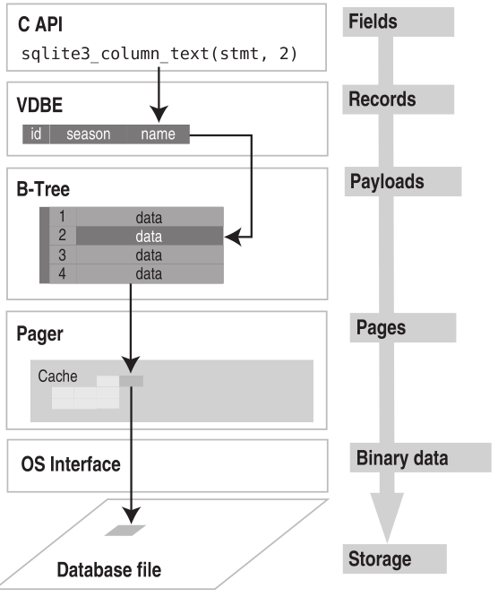
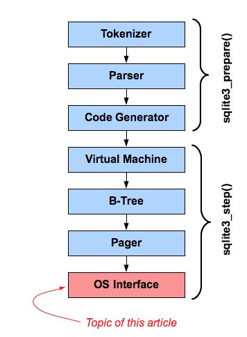

## SQLite 体系结构
sqlite 可以划分为3个子系统的8个独立模块组成。这些模块将查询过程划分为几个独立的任务，流水线工作pipline。在体系结构栈的顶部编译查询语句，在中部执行，在底部处理存储并于操作系统交互。
### 接口
接口位于栈的顶端，由SQLite C API 组成。
### 编译器
编译过程从词法分析器(Tokenizer)和语法分析器(Parser)开始。
SQLite语法分析器时手动编码实现的，由SQLite特定的语法分析生成器Lemon产生的。
### 虚拟机
架构栈的中心部分是虚拟机，即虚拟数据库引擎(Virtual DataBase Engine, VDBE)。VDBE是基于寄存器的VM，在字节码上工作，独立于顶层操作系统、CPU和系统体系结构。
### 后端
后端由B-tree、页缓存(page cache)以及操作系统接口组成。B-tree和pager一起作为信息代理。
B-tree的职责就是排序。它维护多个页之间的复杂关系，用来保证快速定位并找到一切有联系的数据。B-tree将页面组织成树状结构，页面就是树的叶子。pager(SQLite的一种数据结构)帮助B-tree管理页面。
OS接口会根据系统指定如何调用底层系统实现。所有的必须解决的OS问题在OS接口API中以文档的形式记录了。
### 工具和测试代码
工具中包含如内存分配、字符串比较、Unicode转换之类的公共服务。
测试模块中包含了回归测试用例，用来检查数据库代码的每个细节。

### 查询数据
``` sql
sqlite> select * from foods where name='Cinnamon Bobka';
sqlite> select last_insert_rowid();
``` 
### 修改数据
#### 插入记录
``` sql
sqlite> insert into foods (name, type_id) values('Cinnaomon Bobka', 1);
sqlite> insert into foods (NULL, 1, 'Blueberry Bobka');

sqlite> insert into foods
        values(null,
              (select id from food_types where name='Bakery'),
              'Blackberry Bobka');

sqlite> insert into foods
        select last_insert_rowid()+1, type_id, name 
        from foods
        where name='Chocolate Bobka';
```
#### 插入多行数据
``` sql
sqlite> create table foods2(id int, type_id int, name text);
sqlite> insert into foods2 select * from foods;
sqlite> select count(*) from foods2;
``` 
直接指定从select语句中创建表。
``` sql
sqlite> create table foods2 as select * from foods;
``` 
create table 与从foods表选择数据插入表两步并未一步，对于创建临时表特别有用。
``` sql
sqlite> create temp table list as
        select f.name food, t.name name,
               (select count(episode_id)
                from foods_episodes where food_id=f.id) episodes
        from foods f, food_types t
        where f.type_id=t.id;
``` 


#### 更新记录
``` sql
sqlite> update table set update_list where predicate;
``` 
#### 
``` sql
sqlite> delete from table where predicate;
``` 


### 数据完整性
数据完整性用于定义和保护表内部或表之间的数据关系。
一般有四种完整性：
**域完整性、实体完整性、引用完整性和用户自定义完整性。**
1. 域完整性设计控制字段内的值。
2. 实体完整性设计表中的行。
3. 引用完整性设计表之间的行，即外键关系。
4. 用户自定义完整新可以包罗万象。

数据完整性是通过约束实现的。约束就是对字段存储值的一种限制措施。数据库会对字段中的存储值进行完整性约束强制实施。
SQLite中，约束还包括对冲突解决的支持。

``` sql
sqlite> create table contacts (
        id integer primary key,
        name text not null collate nacase,
        phone text not null default 'UNKNOWN',
        unique (name,phone));
```
字段级的约束包括not null, unique, primary key, foreign key, check和collate。
表一级约束包括primary key, unique以及check。

#### 主键约束
在SQLite中,不管有没有定义主键,都会有一个字段,rowid,64-bit整性字段,还有两个别名_rowid_和oid, 默认取值按照增序自动生成。

像唯一性约束一样，主键约束也可以定义在多个字段中。
```sql
sqlite> create table pkey(x text, y text, primary key(x,y));
sqlite> insert into pkey values('x', 'y');
sqlite> insert into pkey values('x', 'x');
sqlite> select rowid, x, y from pkey;
```
|rowid|x|y|
|-|-|-|
|1|x|y|
|2|x|x|

#### 域完整性
定义：字段的值必须是字段定义范围内的。
域处理两个事情：**类型和范围**。
##### 默认值
default只是一个约束，它确保该字段有值，并在需要时出现。
default还可以接受3种预定格式的ANSI/ISO保留字，用于生成日期和时间值。
current_time生成格式(HH:MM:SS)的当前时间。
current_data生成格式(YYYY-MM-DD)的当前日期。
current_timestamp生成格式(YYYY-MM-DD HH:MM:SS)的事件戳。
```sql
sqlite> create table times
        (id integer, data not null default current_date,
        time not null default current_time,
        timestamp not null default current_timestamp);
```

```sql
sqlite> create tabe times
        (id integer, data not null default current_date,
        time not null default current_time,
        timestamp not null default current_timestamp,
        localtimestamp not null default (datetime(CURRENT_TIMESTAMP,'localtime')));
```
注意之上有时区转换的语句。
##### NOT NULL
NOT NULL约束可以确保该字段不为NULL。处理未知数据和NOT NULL约束的实用方法时给该字段设定默认值。
##### check约束
check约束允许定义表达式来测试要插入或更新的字段值。
```sql
sqlite> create table contacts
        (id integer primary key, 
        name text not null collate nocase,
        phone text not null default 'UNKNOWN',
        unique (name, phone),
        check (length(phone)>=7));
```
所有字段的check约束都是在修改发生前评估的。
从功能上看，触发器可以与check约束一样有效地实现数据完整性。
##### 外键约束
SQLite支持关系理论中的关系完整性概念。关系完整性也叫外键。
```sql
sqlite> create table table_name
        (column_defination references foreign_table (column_name)
        on {delete|update} integrity_action
        [not] deferrable [initially{deferred|immediate},] _);
```


```sql
sqlite> create TABLE food_types
        (id integer primary key,
        name text);
sqlite> create TABLE foods
        (id integer primary key,
        type_id integer,
        name text);
```
为确保上面foods表中type_id之都存在与food_types的id字段，可如下方式定义表foods：

```sql
sqlite> create table foods
        (id integer primary key,
        type_id integer references food_types(id)
        on delete restrict
        deferrable initially deferred,
        name text);                  
```
完整的规定定义如下：
 * set null： 如果父值被删除获知不错在，剩余的子值将改为null；
 * set default: 如上，则子值改为默认值；
 * casecade: 更新父值时，更新所有预知匹配的子值。删除父值时，删除所有的子值。casecade的删除功能会出现意想不到的效果；
 * restrict： 更新或删除父值可能会出现孤立的子值，从而阻止事务；
 * no action: 使用一种松弛的方法，不干涉操作执行，只是观察变化。

##### 排序规则
SQLite有三种内置的排序规则，默认是二进制排序规则，该规则使用C函数memcpy()逐字节比较文本值。第二种是nocase，是拉丁字母中使用26个ASCII字符的非大小写敏感排序算法。第三种是reverse排序规则，它与二进制排序规则相反。

## 存储类
|名称|说明|
|-|-|
| integer|值是一个带符号的整数,根据值的大小存储在 1、2、3、4、6 或 8 字节中。|
|real|值是一个浮点值，存储为 8 字节的 IEEE 浮点数字。|
|text|值是一个文本字符串，使用数据库编码（UTF-8、UTF-16BE 或 UTF-16LE）存储。|
|blob|值是一个 blob 数据，完全根据它的输入存储。|
|NULL|值是一个 NULL 值。|

SQL函数typeof()根据值的表示法返回其存储类。
```sql
sqlite> select typeof(3.14), typeof('3.14'),
        typeof(314), typeof(x'3142), typeof(NULL);
```
|typeof(3.14)|typeof('3.14')| typeof(314)|typeof(x'3142)|typeof(NULL)|
|-|-|-|-|-|
|real|text|integer|blob|NULL|

**SQLite中单独的一个字段可能包含不同存储类的值。**

```sql
sqlite> drop table domain;
sqlite> create table domain(x);
sqlite> insert into domain values(3.142);
sqlite> insert into domain values('3.142');
sqlite> insert into domain values(3142);
sqlite> insert into domain values(x'3142');
sqlite> insert into domain values(null);
```
不同类型值的比较顺序
NULL<<integer=real<<text<<blob。

## 视图
视图即虚拟表，也称派生表，其内容都派生自其它表的查询结果。
```sql
sqlite> create view name as select-stmt;
```
```sql
sqlite> select f.name, ft.name, e.name 
        from foods f
        inner join food_types ft on f.type_id = ft.id
        inner join foods_episodes fe on f.id=fe.food_id
        inner join episodes e on fe.episode_id = e.id;
sqlite> create view details as
        select f.name as fd, tf.name as tp, e.name as ep, e.season as ssn
        from foods f
        inner join food_types ft on f.type_id=ft.id
        inner join foods_episodes fe on f.id= fe.food_id
        inner join episodes e on fe.episodes=e.id;
```
创建视图后，可以像查询表一样查询details
```sql
sqlite> select fd as Food, ep as Episode
        from details where ssn=7 and tp like 'Drinks';
```
视图的内容是动态生成的。因此，每次使用details时，基于数据库的当前数据执行相关的SQL语句，产生结果。
视图的删除
```sql
sqlite> drop view name;
```
## 索引

SQLite使用B-tree做索引。
索引可以加速查询，但可能降低insert、update和类似操作的速度。
```sql
sqlite> create index [unique] index_name on table_name (columns);
sqlite> drop index index_name;
```

### 使用索引
SQLite中有一些具体的条件来判断是否使用索引。
如果可以，对于下面会在WHERE子句中出现的表达式，SQLite将使用单个字段索引。
```sql
sqlite> column {=|>|>=|<|<=} expression
        expression {=|>|>=|<|<=} column
        column IN (expression-list)
        column IN (subquery)
```
最后，创建索引时，一定要有理由确保可以获得性能的改善。选择好的索引时非常重要的；分布凌乱的索引可能会导致希望获得良好的性能愿望落空。

## 触发器
```sql
sqlite> create [temp|temprary] trigger name
        [before|after] [insert|delete|update|update of columns] on table
        action
```
触发器时通过名称、行为和表定义的。行为(或者称为触发体)由一系列SQL命令组成，当某些事件发生时，触发器负责启动这些命令。
事件包括在具体的表中执行delete、insert和update命令。
触发器可以用来创建自定义完整性约束、日志变更、更新表和其它事情。
触发器的作用只限于所写的SQL命令。
### 更新触发器
与insert和delete触发器不同，update触发器可以在表的执行字段上定义。这种触发器的格式一般为：
```sql
sqlite> create trigger name
        [before|after] update of column on table
        action
```
下面时一个update触发器的SQL脚本
```sql
sqlite> create temp table log(x);
sqlite> create temp trigger foods_update_log update of name on foods
        begin
          insert into log values('updated foods: new name=' ||new.name);
        end;
```

### 错误处理
定义为事件发生前执行的触发器有机会阻止事件的发生，同样，定义为事件发生后执行的触发器可以检查事件，具备重新思考的机会。
before和after触发器可以具备实施新的完整性约束。
SQLite提供一个特殊的SQL函数raise()供触发器调用，该函数允许在触发器内产生错误。
```sql
sqlite> raise(resolution, error_message);
```
第一个参数时冲突解决策略(abort, fail, ignore, rollback等)。第二个参数时错误消息。

### 可更新的视图


## 事务
事务定义了一组SQL命令的边界。
### 事务的范围
事务由3个命令控制：begin、commit和rollback。
begin开始一个事务，如果没有commit，begin之后所有的操作会被取消，rollback类似。
commit提交事务开始后执行的所有操作。
SQLite也支持savepoint和release命令。包含多个语句的工作体可以设置savepoint，回滚可以返回到某个savepoint。
```sql
sqlite> savepoint justincase;
sqlite> rollback [transcation] to justincace;
```
### 冲突解决
SQLite有特殊的方法允许指定不同的方式来处理约束违反。
默认行为时终止命令并回滚所有修改，保证事务的完整性。
SQLite提供5种可能的冲突解决方案或策略：replace、ignore、fail、abort和rollback。
```sql
sqlite> insert or resolution into table (column_list) values(value_list);
sqlite> update or resolution table set (value_list) where predicate;
```
### 数据库锁
在SQLite中，锁和事务时紧密相连的。SQLite使用锁逐步提升机制，有5中不同的锁状态：未加锁(unlocked)、共享(shared)、预留(reserved)、未决(pending)、排它(exclusive)。

### 事务的类型
在SQLite有三种不同的事务类型，[deferred|immediate|exclusive].
```sql
sqlite> begin [deferred|immediate|exclusive] transaction;
```

# 总体设计和概念
对象模型

### 执行预查询
VDBE：虚拟数据库引擎(Virtual DataBase Engine,VDBE)；

执行一条SQL命令的处理分为以下三个步骤：
 * 准备：语法分析器、词法分析器以及代码生成器将命令编译成VDBE字节码，以准备SQL语句。编译器创建sqlite3_stmt句柄，包括字节码、执行命令和迭代结果集所需的所有其它资源。
 * 执行：VDBE执行字节码。执行时意个逐步的过程。C API中，每一步都由sqlite3_step()发起，并使VDBE逐步执行字节码。第一次调用slqite3_step()通常需要某种类型的锁，锁的类型根据执行什么样的命令(读或写)而变化。对于SELECT语句，sqlite3_step()的每次调用将使语句句柄的游标位置移动到结果集的下一行。对于结果集中的每一行，游标未到达结果集的末尾时，将返回SQLITE_ROW；反之，将返回SQLITE_DONE。对于其它SQL语句(insert, update, delete)，第一次调用sqlite3_step()将促使VDBE执行整个命令。
 * 完成：VDBE关闭语句并释放资源。C API中，由sqlite3_finalize()来执行，该函数使得VDBE终止程序、释放资源并关闭statement句柄。

以下伪代码说明SQLite中执行一个查询的通用处理
```sql
# 1. 打开数据库，创建一个连接对象db
db = open('foods.db')

# 2.A. 准备一个statement（stmt）
stmt = db.prepare('SELECT * FROM episodes')

# 2.b. 执行，调用step(), 直到游标到达结果集末尾。
while stmt.step() == SQLITE_ROW
    print stmt.colum('name');
end

# 2.c. 完成后释放读锁。
stmt.finalize()

# 3. 插入一条记录
stmt = db.prepare('INSERT INTO foods VALUES(...)')
stmt.step()
stmt.finalize()

# 4. 关闭数据库连接。
db.close()
```

#### 临时存储器
临时存储器可以是RAM或文件，并通过编译指示**temp_store**明确指定。采用基于文件的存储，可以使用编译指示**temp_store_directory**来明确存储文件的路径。

### 使用参数化SQL

SQL语句可以包含参数，参数就是占位符，可能会在编译后为其提供值。
```sql
sqlite> insert into foods (id,name) values(?,?);
sqlite> insert into episodes (id,name) (:id, :name);
```
参数绑定的优点是无需重新编译，就可以多次执行相同语句。可以避免SQL编译开销。
参数绑定的另一个优点时SQLite会处理绑定到参数的转义字符。避免了语法错误和可能的SQL注入式攻击。

```sql
db = open('foods.db')
stmt = db.prepare('insert into episodes (id, name) values (:id, :name)')

stmt.bind('id', '1')
stmt.bind('name', 'Soup Nazi')
stmt.step()

stmt.reset()
stmt.bind('id', '2')
stmt.bind('name', 'The Junior Mint')

stmt.finalize()
db.close()
```

### 错误处理
```
if db.errcode() != SQLITE_OK
        print db.errmg(stmt)
```
### SQL语句格式化
```c
char * before = "Hey, at least %q no pig-man.";
char * after = sqlite3_mprintf(before, "he's");
```

### 可操作的控制
API中包含很多监视、控制或限制数据库中发生什么的命令。
SQLite以过滤或者回调函数方式实现该功能，可以为指定事件注册要调用的函数。
由三种钩子函数：
 * sqlite3_commit_hook(),用于监视连接上的事务提交；
 * sqlite3_rollback_hook(),用于监视回滚；
 * sqlite3_update_hook(),用于监视insert、update和delete命令更改操作。

此外，API提供名为sqlite3_set_authorizer()的功能非常强大的编译时钩子。该函数几乎提供对数据库中发生的一切事件的细粒度控制，并能够限制对数据库、表和列的访问和修改。

### 使用线程
SQLite拥有一批在多线程环境中使用的函数。
在3.3.1版本中，SQLite引入了独特的运行模式：共享缓存模式。该模式时为多线程的嵌入式服务器设计的，它可以让单个线程拥有共享页面缓存的多个连接，从而减低服务器的总内存。

# 核心 C API

## 连接与断开连接

```c
int sqlite3_open_v2(
        const char * filename,
        sqlite3 **ppDb,
        int flags,
        const char *zVfs
);

int sqlite3_open(
        const void *filename,
        sqlite3 **ppDb
);

int sqlite3_open16(
        const void *filename,
        sqlite3 **ppDb
);

```

### 执行查询
```c
int sqlite3_exec(
        sqlite3*,
        const char *sql,
        sqlite_callback,
        void *data,
        char **errmsg
);
```
回调函数声明：
```c
typedef int (*sqlite3_callback)(
        void*, // sqlite3_exec()函数第四个参数提供数据，
        int,   // 行中字段的数目
        char**,// 代表行中字段名称的字符串数组
        char** // 代表字段名称的字符串数组
);
```

简单的SQLite查询
``` c
int main(int argc, char **argv){
        sqlite3 *db;
        char *zErr;
        int rc;
        char *sql;
        rc = sqlite3_open_v2("test.db", &db);
        if(rc){
                fprintf(stderr, "can't open db: %s\n", sqlite3_errmsg(db));
                exit(1);
        }

        sql = "create table episodes(id int, name text);";
        rc = sqlite3_exec(db,sql, NULL, NULL, &zErr);

        if(rc!=SQLITE_OK)
        {
                if(zErr!=NULL){
                        fprintf(stderr, "SQL error:%s\n", zErr);
                        sqlite3_free(zErr);//注意要释放内存
                }
        }
        sql = "insert into episodes values (10, 'The Dinner Party')";
        rc = sqlite3_exec(db, sql, NULL, NULL, &zErr);

        sqlite3_close(db);
        return 0;
}
```
使用sqlite3_exec()处理记录

```c
int callback(void* data, int ncols, char** values, char** headers);
int main(int argc, char** argv)
{
        sqlite3 *db;
        int rc;
        char *sql;
        char *zErr;

        rc = sqlite3_open_v2("test.db", &db);
        if(rc)
        {
                fprintf(stderr, "Can't open database: %s\n", sqlite3_errmsg(db));
                sqlite3_close(db);
                sqlite3_close(db);
                exit(1);
        }
        const char* data = "Callback function called";
        sql = "insert into episodes (id, name) values(11, 'Mackinaw Peaches');"
        "select * from episodes;";
        rc = sqlite3_exec(db, sql, callback, data, &zErr);
        if(rc!=SQLITE_OK){
                if(zErr!=NULL){
                        fprintf(stderr, "SQL error:%s\n", zErr);
                        sqlite3_free(zErr);
                }
        }
        sqlite3_close(db);
        return 0;
}
int callback(void* data, int ncols, char** values, char** headers)
{
        int i;
        fprintf(stderr, "%s: ", (const char*)data);
        for(i=0; i < ncols; i++) {
                fprintf(stderr, "%s=%s ", headers[i], values[i]);
        }
        fprintf(stderr, "\n");
        return 0;
}
```

### 准备查询

准备查询优点
 * 准备查询不需要回调接口，编码简单、清晰；
 * 准备查询关联了提供列信息的函数，可以获取列的存储类型、声明类型、模式名称、表明和数据库名。sqlite3_exec()的回调接口只提供列的名称。
 * 准备查询提供了一种除文本外的获取字段/列值的方法，可以以C数据类型获取，例如int和double型，而sqlite3_exec()的回调接口只提供字符串格式的字符值；
 * 准备查询可以重新运行，可以重用已编译的SQL；
 * 准备查询支持参数化的SQL语句；

#### 检查变化
执行更新或删除操作时，可以从sqlite3_changes()获取由多少记录受影响。

### 获取表查询
函数sqlite3_get_table()返回单独函数调用中的一个命令的整个结果集。
```c
int sqlite3_get_table(
        sqlite3*,
        const char *sql,
        char ***resultp,
        int *nrow,
        int *ncolumn,
        char **errmsg
);
```

```sql
int main(int argc, char **argv)
{
        /* Connect to database, etc. */
        char *result[];
        sql = "select * from episodes;";
        rc = sqlite3_get_table(db, sql, &result, &nrows, &ncols, &zErr);
        /* Do something with data */
        /* Free memory */
        sqlite3_free_table(result);
}
```

## 准备查询

### 编译
编译或准备接受SQL语句，并将其编译为虚拟数据库引擎VDBE刻度的字节码。
函数声明：
```c
int sqlite3_parepare_v2(
        sqlite3 *db, /* Database handle */
        const char *zSql, /* SQL text, UTF-8 encoded */
        int nBytes, /* Length of zSql in bytes. */
        sqlite3_stmt **ppStmt, /* OUT: Statement handle */
        const char **pzTail /* OUT: Pointer to unused portion of zSql */
);
```
函数sqlite3_prepare_v2()不会对连接或数据库有任何影响，也不会启动事务或获取锁。语句句柄高度依赖它们所被编译的数据库模式。如果另一个连接在您准备语句和实际执行语句期间更改了数据库模式，那准备语句就会失效。失效后会尝试重新编译，如果不能成功将会导致SQLITE_SCHEMA相关错误。

### 执行
查询语句就绪后，由sqlite3_step()执行。
```c
int sqlite3_step(sqlite3_stmt *pStmt);
```
sqlite3_step()接受语句句柄，并直接与VDBE通信，生成执行SQL语句的每个步骤的字节码指令。第一次调用sqlite3_step()时，VDBE获得执行改命令所需的必要的数据库锁。不能获取锁并且没有指派繁忙处理程序，sqlite3_step()将返回SQLITE_BUSY。如果指派了繁忙处理程序，将调用该程序。

### 完成与重置
一旦语句执行结束，必须终止。
```c
int sqlite3_finalize(sqlite3_stmt *pStmt);
int sqlite3_reset(sqlite3_stmt *pStmt);
```
sqlite3_finalize()关闭语句stmt，释放资源并提交或回滚任何隐式事务，清除日志文件并释放相关联的锁。

```c
int test_2()
{
    int rc, i, ncols;
    sqlite3 *db;
    sqlite3_stmt *stmt;
    char *sql;
    const char *tail;
    rc = sqlite3_open("test.db", &db);
    if(rc) {
        fprintf(stderr, "Can't open database: %s\n", sqlite3_errmsg(db));
        sqlite3_close(db);
        return  (1);
    }
    sql = "select * from episodes;";
    rc = sqlite3_prepare_v2(db, sql, -1, &stmt, &tail);
    if(rc != SQLITE_OK) {
        fprintf(stderr, "SQL error: %s\n", sqlite3_errmsg(db));
    }
    rc = sqlite3_step(stmt);
    ncols = sqlite3_column_count(stmt);
    while(rc == SQLITE_ROW) {
        for(i=0; i < ncols; i++) {
            fprintf(stderr, "'%s' ", sqlite3_column_text(stmt, i));
        }
        fprintf(stderr, "\n");
        rc = sqlite3_step(stmt);
    }
    sqlite3_finalize(stmt);
    sqlite3_close(db);
    return 0;
}
```

sqlite3_prepare_v2()可以接受包含多条SQL语句的字符串。通过pzTail参数确保处理字符串中其余SQL语句变得容易。
```c
while(sqlite3_complete(sql))
{
        rc = sqlite3_prepare(db, sql, -1, &stmt, &tail);
        //process query results

        // skip to next cmd in string
        sql = tail;
}
```
### 获取记录
函数声明：
```c
int sqlite3_column_count(sqlite3_stmt *pStmt);
int sqlite3_data_count(sqlite3_stmt *pStmt);
```
#### 获取字段信息
```c


const char *sqlite3_column_name(sqlite3_stmt*, int iCol);
int sqlite3_column_type(sqlite3_stmt*, int iCol);

#define SQLITE_INTEGER 1
#define SQLITE_FLOAT 2
#define SQLITE_TEXT 3
#define SQLITE_BLOB 4
#define SQLITE_NULL 5
```
sqlite3_column_decltype()函数获取字段在表模式定义中声明的数据类型。
```c
const char *sqlite3_column_decltype(sqlite3_stmt*, int iCol);
```

除了类型声明，还可以使用以下函数获得某一列的其它信息：
```c
const char *sqlite3_column_database_name(sqlite3_stmt *pStmt, int iCol);
const char *sqlite3_column_table_name(sqlite3_stmt *pStmt, int iCol);
const char *sqlite3_column_origin_name(sqlite3_stmt *pStmt, int iCol);
```
The first function will return the database associated with a column, the second will return its table, and
the last function will return the column’s actual name as defined in the schema. **Note that these functions are available only if you compile SQLite with the
SQLITE_ENABLE_COLUMN_METADATA preprocessor directive.**

### Getting Column Values

```c
int sqlite3_column_int(sqlite3_stmt*, int iCol);
double sqlite3_column_double(sqlite3_stmt*, int iCol);
long long int sqlite3_column_int64(sqlite3_stmt*, int iCol);
const void *sqlite3_column_blob(sqlite3_stmt*, int iCol);
const unsigned char *sqlite3_column_text(sqlite3_stmt*, int iCol);
const void *sqlite3_column_text16(sqlite3_stmt*, int iCol);
```

|Internal |Type Requested |Type Conversion|
|-|-|-|
|NULL |INTEGER |Result is 0.|
|NULL |FLOAT |Result is 0.0.|
|NULL |TEXT |Result is a NULL pointer.|
|NULL |BLOB |Result is a NULL pointer.|
|INTEGER |FLOAT |Convert from integer to float.|
|INTEGER |TEXT |Result is the ASCII rendering of the integer.|
|INTEGER |BLOB |Result is the ASCII rendering of the integer.|
|FLOAT |INTEGER |Convert from float to integer.|
|FLOAT |TEXT |Result is the ASCII rendering of the float.|
|FLOAT |BLOB |Result is the ASCII rendering of the float.|
|TEXT |INTEGER |Use atoi().|
|TEXT |FLOAT |Use atof().|
|TEXT |BLOB |No change.|
|BLOB |INTEGER |Convert to TEXT and then use atoi().|
|BLOB |FLOAT |Convert to TEXT and then use atof().|
|BLOB |TEXT |Add a \000 terminator if needed.|

BLOB复制时碧血指定其长度。对于BLOB列，可以使用sqlite3_column_bytes()获取实际数据长度。
```c
int sqlite3_column_bytes(sqlite3_stmt*, int iCol);
```
获取数据副本的方法
```c
int len = sqlite3_column_bytes(stmt,iCol);
void* data = malloc(len);
memcpy(data,sqlite3_column_blob(stmt,iCol),len);
//memcpy(void *Dst, void *Src, size_t n)
```
返回语句的连接句柄
```c
int sqlite3_db_handle(sqlite3_stmt*);
```
以上获取连接句柄的函数，在一些使用语句句柄的函数遇到措施时，获取语句的连接句柄，并从sqlite3_errmsg()中获取错误信息。

### 参数化查询 Prameterized Queries

```c
int sqlite3_bind_int(sqlite3_stmt*, int, int);
int sqlite3_bind_double(sqlite3_stmt*, int, double);
int sqlite3_bind_int64(sqlite3_stmt*, int, long long int);
int sqlite3_bind_null(sqlite3_stmt*, int);
int sqlite3_bind_blob(sqlite3_stmt*, int, const void*, int n, void(*)(void*));
int sqlite3_bind_zeroblob(sqlite3_stmt*, int, int n);
int sqlite3_bind_text(sqlite3_stmt*, int, const char*, int n, void(*)(void*));
int sqlite3_bind_text16(sqlite3_stmt*, int, const void*, int n, void(*)(void*));
```
绑定函数可以分为两类，一类用于标量值(int, double, int64, NULL),
另一类用于数组(blob, text, text16)。
API为清理句柄提供了如下两个有特殊含义的预定义值。
```c
#define SQLITE_STATIC ((void(*)(void *))0)
#define SQLITE_TRANSIENT ((void(*)(void *))-1)
```
每个值指定一个特定的清理操作。SQLITE_STATIC告诉数组绑定函数数组内存驻留在非托管的空间，SQLite不会试图清理该空间。SQLITE_TRANSIENT告诉绑定函数数组内存经常变化，SQLite需要使用自己的数据副本，该数据副本在语句总结时会自动清除。第三个选项提供过一个指向用户自定义的清理函数的指针，该清理函数形式如下：
```c
void cleanup_fn(void *)'
```
```c
const char* sql = "insert into foo values(?,?,?)";
sqlite3_prepare(db, sql, strlen(sql), &stmt, &tail);
sqlite3_bind_int(stmt, 1, 2);
sqlite3_bind_text(stmt, 2, "pi");
sqlite3_bind_double(stmt, 3, 3.14);
sqlite3_step(stmt);
sqlite3_finalize(stmt);
```
### 参数编号
对于位置参数，sqlite3_prepare()分配从1开始的顺序整数值。
sqlite也允许为参数指定编号，而不是必须使用内部的序列。
参数标号的语法是问号后紧跟一个数字。
```c
// example
name = "Mackinaw Peaches";
sql = "insert into episodes (id, cid, name) "
"values (?100,?100,?101)";
rc = sqlite3_prepare(db, sql, strlen(sql), &stmt, &tail);
if(rc != SQLITE_OK) {
        fprintf(stderr, "sqlite3_prepare() : Error: %s\n", tail);
        return rc;
}

sqlite3_bind_int(stmt, 100, 10);
sqlite3_bind_text(stmt, 101, name, strlen(name), SQLITE_TRANSIENT);

sqlite3_step(stmt);
sqlite3_finalize(stmt);
```
**注意，在SQL语句中给参数编号时，请记住允许的范围时整数值1~999。若要取得最优的性能和内存利用率，应选择较小的数字。**
### 参数命名 named parameters
第三种参数绑定的方法是给参数命名。标识命名的参数实在前面加上一个冒号或AT符号@的参数的名称。
```c
name = "Mackinaw Peaches";
sql = "insert into episodes (id, cid, name) values (:cosmo,:cosmo,@newman)";
rc = sqlite3_prepare(db, sql, strlen(sql), &stmt, &tail);
sqlite3_bind_int( stmt,
sqlite3_bind_parameter_index(stmt, ":cosmo"), 10);
sqlite3_bind_text( stmt,
sqlite3_bind_parameter_index(stmt, "@newman"),
                name,strlen(name), SQLITE_TRANSIENT );
sqlite3_step(stmt);
sqlite3_finalize(stmt);
```

### TCL 参数
最后一个参数模式名称为Tcl参数，是Tcl的特定扩展。基本上，它与参数命名完全相同，只是使用一些变量作为参数名称。Tcl扩展中调用相当于sqlite_prepare()的Tcl函数时，Tcl扩展自动搜索与给定参数名相同的活跃的Tcl变量，并将它们绑定到各自的参数。

## 错误与异常 Errors and the Unexpected
可返回结果代码的API函数：
```c
sqlite3_bind_xxx()
sqlite3_close()
sqlite3_create_collation()
sqlite3_collation_needed()
sqlite3_create_function()
sqlite3_prepare_v2()
sqlite3_exec()
sqlite3_finalize()
sqlite3_get_table()
sqlite3_open_v2()
sqlite3_reset()
sqlite3_step()
```
|Code |Description|
|-|-|
|SQLITE_OK |The operation was successful.|
|SQLITE_ERROR |General SQL error or missing database. It may be possible to obtain moreerror information depending on the error condition (SQLITE_SCHEMA, for example).|
|SQLITE_INTERNAL |Internal logic error.|
|SQLITE_PERM |Access permission denied.|
|SQLITE_ABORT |A callback routine requested an abort.|
|SQLITE_BUSY |The database file is locked.|
|SQLITE_LOCKED |A table in the database is locked.|
|SQLITE_NOMEM |A call to malloc() has failed within a database operation.|
|SQLITE_READONLY |An attempt was made to write to a read-only database.|
|SQLITE_INTERRUPT |Operation was terminated by sqlite3_interrupt().|
|SQLITE_IOERR |Some kind of disk I/O error occurred.|
|SQLITE_CORRUPT |The database disk image is malformed. This will also occur if an attempt ismade to open a non-SQLite database file as a SQLite database.|
|SQLITE_FULL |Insertion failed because the database is full. There is no more space on the file system or the database file cannot be expanded.|
|SQLITE_CANTOPEN |SQLite was unable to open the database file.|
|SQLITE_PROTOCOL |The database is locked or there has been a protocol error.|
|SQLITE_EMPTY |(Internal only.) The database table is empty.|
|SQLITE_SCHEMA |The database schema has changed.|
|SQLITE_CONSTRAINT |Abort due to constraint violation.|
|SQLITE_MISMATCH |Data type mismatch. An example of this is an attempt to insert noninteger data into a column labeled INTEGER PRIMARY KEY. For most columns, SQLite ignores the data type and allows any kind of data to be stored. But an INTEGER PRIMARY KEY column is allowed to store integerdata only.|
|SQLITE_MISUSE |Library was used incorrectly. This error might occur if one or more of the SQLite API routines is used incorrectly.|
|SQLITE_NOLFS |Uses OS features not supported on host. This value is returned if the SQLite library was compiled with large file support (LFS) enabled but LFS isn’t supported on the host operating system.|
|SQLITE_AUTH |Authorization denied. This occurs when a callback function installed using sqlite3_set_authorizer() returns SQLITE_DENY.|
|SQLITE_FORMAT |Auxiliary database format error.|
|SQLITE_RANGE |Second parameter to sqlite3_bind() out of range.|
|SQLITE_NOTADB |File opened is not a SQLite database file.|
|SQLITE_ROW |sqlite3_step() has another row ready.|
|SQLITE_DONE |sqlite3_step() has finished executing.|


### 繁忙情况处理
有关处理查询的两个重要函数是sqlite3_busy_handle()和sqlite3_busy_timeout()。
当调用需要获取锁的SQLiteAPI函数并且SQLite无法得到锁时，函数就会返回SQLITE_BUSY。
处理这种情况方法有三种：
 * 用户自己处理SQLITE_BUSY，并通过重新运行该语句，或采取一些其它方法。
 * 让SQLite调用繁忙处理程序。
 * 让SQLite等待(阻塞或睡眠)一段锁解锁的时间。
  
#### 用户自定义的繁忙处理
第二个选项需要使用sqlite3_busy_handle()。该函数提供了调用用户自定义函数的方法，而不是立即去阻塞或者返回SQLITE_BUSY。
```c
int sqlite3_busy_handle(sqlite3*, int(*)(void*, int), void*);
```
**建议** todo：P197

## 模式改变处理 Handling Schema Changes
当连接更改了数据库模式，所有在改变发生前编译的准备语句都将失效。其结果是，这种语句的第一个sqlite3_step()调用将尝试重新编译有关SQL并尽可能正常运行。如果重新编译无法实现，则sqlite3_step()返回错误代码SQLITE_SCHEMA。从锁定的角度来看，模式更改发生的时间介于对编译语句sqlite3_prepare()调用和执行语句sqlite3_step()的调用之间。
这种情况发生时，唯一的应对方法就是处理改变并重新开始。
以下一些事件可能会导致SQLITE_SCHEMA错误：
 * 分离数据库
 * 修改或安装用户自定义的函数或聚合
 * 修改或安装用户自定义排序
 * 修改或安装授权函数
 * 清理数据库空间
  
SQLITE_SCHEA情况催在的最总原因与VDBE有关。
#### 追踪SQL TRACING SQL
```c
void *sqlite3_trace(sqlite3*， void(*xTrace)（void*， const char*), void*);
```

## 操作控制 
API提供了一些函数，可以在编译时和运行时监视和管理SQL命令。

### 提交钩子
```c
void *sqlite3_commit_hook(sqlite3 *cnx,
                        int(*xCallBack)(void *data),
                        void *data);
```
当连接cnx上提交事务时将触发该回调函数。第三个参数时一个指向应用程序特定数据的指针，SQLite将该数据传递给回调函数，如果该回调函数返回非零值，提交将转换为回滚。
在回调函数指针中传入NULL，可以有效地禁用当前注册函数。此外，给定的连接一次只能注册一个回调函数。

### 回滚钩子
```c
void *sqlite3_rollback_hook(sqlite3 *cnx,
                        int(*xCallBack)(void *data),
                        void *data);
```
当连接cnx上的回滚事件触发回调函数，不管是通过显示的回滚命令、隐式错误还是违反约束导致的回滚。如果是由于数据库连接关闭导致的自动回滚，将无法出发回调函数。

### 更新钩子
函数sqlite3_update_hook()用于监视给定连接上对行的所有更新、插入和删除操作。
```c
void sqlite3_update_hook(
        sqlite3 *cnx,
        void(*)(void*, int, char const*, char const*, sqlite_int64),
        void *data
);
```
回调函数的形式
```c
void callback(
        void *data,
        int operation_code,
        char const* db_name,
        char const* table_name,
        sqlite_int64 rowid
);
```
### 授权函数
```c
int sqlite3_set_authorizer(
        sqlite3*,
        int (*xAuth)(void*, int, const char*, const char*, const char*, const char*),
        void *pUserData
);
```
```c
int auth( void*, /* user data */
        int, /* event code */
        const char*, /* event specific */
        const char*, /* event specific */
        const char*, /* database name */
        const char* /* trigger or view name */ );
```

授权函数例子：
 * 阻止读取列z
 * 阻止更新列x
 * 监控加载和分离数据库事件
 * 记录数据库事件日志
  
```c
const char event_desc[64];
const char* event_description(int type)
{
    memset(event_desc,0x00,64);
    switch(type)
    {
    case 1 : sprintf(event_desc,"SQLITE_CREATE_INDEX       ");break;
    case 2 : sprintf(event_desc,"SQLITE_CREATE_TABLE       ");break;
    case 3 : sprintf(event_desc,"SQLITE_CREATE_TEMP_INDEX  ");break;
    case 4 : sprintf(event_desc,"SQLITE_CREATE_TEMP_TABLE  ");break;
    case 5 : sprintf(event_desc,"SQLITE_CREATE_TEMP_TRIGGER");break;
    case 6 : sprintf(event_desc,"SQLITE_CREATE_TEMP_VIEW   ");break;
    case 7 : sprintf(event_desc,"SQLITE_CREATE_TRIGGER     ");break;
    case 8 : sprintf(event_desc,"SQLITE_CREATE_VIEW        ");break;
    case 9 : sprintf(event_desc,"SQLITE_DELETE             ");break;
    case 10: sprintf(event_desc,"SQLITE_DROP_INDEX         ");break;
    case 11: sprintf(event_desc,"SQLITE_DROP_TABLE         ");break;
    case 12: sprintf(event_desc,"SQLITE_DROP_TEMP_INDEX    ");break;
    case 13: sprintf(event_desc,"SQLITE_DROP_TEMP_TABLE    ");break;
    case 14: sprintf(event_desc,"SQLITE_DROP_TEMP_TRIGGER  ");break;
    case 15: sprintf(event_desc,"SQLITE_DROP_TEMP_VIEW     ");break;
    case 16: sprintf(event_desc,"SQLITE_DROP_TRIGGER       ");break;
    case 17: sprintf(event_desc,"SQLITE_DROP_VIEW          ");break;
    case 18: sprintf(event_desc,"SQLITE_INSERT             ");break;
    case 19: sprintf(event_desc,"SQLITE_PRAGMA             ");break;
    case 20: sprintf(event_desc,"SQLITE_READ               ");break;
    case 21: sprintf(event_desc,"SQLITE_SELECT             ");break;
    case 22: sprintf(event_desc,"SQLITE_TRANSACTION        ");break;
    case 23: sprintf(event_desc,"SQLITE_UPDATE             ");break;
    case 24: sprintf(event_desc,"SQLITE_ATTACH             ");break;
    case 25: sprintf(event_desc,"SQLITE_DETACH             ");break;
    case 26: sprintf(event_desc,"SQLITE_ALTER_TABLE        ");break;
    case 27: sprintf(event_desc,"SQLITE_REINDEX            ");break;
    case 28: sprintf(event_desc,"SQLITE_ANALYZE            ");break;
    case 29: sprintf(event_desc,"SQLITE_CREATE_VTABLE      ");break;
    case 30: sprintf(event_desc,"SQLITE_DROP_VTABLE        ");break;
    case 31: sprintf(event_desc,"SQLITE_FUNCTION           ");break;
    case 32: sprintf(event_desc,"SQLITE_SAVEPOINT          ");break;
    case 0 : sprintf(event_desc,"SQLITE_COPY               ");break;
    case 33: sprintf(event_desc,"SQLITE_RECURSIVE          ");break;
    default: sprintf(event_desc,"UNKOUWN EVENT");
    }
    return event_desc;
}
int auth( void* x, int type,
          const char* a, const char* b,
          const char* c, const char* d )
{
    const char* operation = a;
    printf( " %s ", event_description(type));
/* Filter for different database events
** from SQLITE_TRANSACTION to SQLITE_INSERT,
** UPDATE, DELETE, ATTACH, etc. and either allow or deny
** them.
*/
    if((a != NULL) && (type == SQLITE_TRANSACTION)) {
        printf(": %s Transaction", operation);
    }
    switch(type) {
    case SQLITE_CREATE_INDEX:
    case SQLITE_CREATE_TABLE:
    case SQLITE_CREATE_TRIGGER:
    case SQLITE_CREATE_VIEW:
    case SQLITE_DROP_INDEX:
    case SQLITE_DROP_TABLE:
    case SQLITE_DROP_TRIGGER:
    case SQLITE_DROP_VIEW:
        {
            // Schema has been modified somehow.
            printf(": Schema modified");
        }
    }
    if(type == SQLITE_READ) {
        printf(": Read of %s.%s ", a, b);
        /* Block attempts to read column z */
        if(strcmp(b,"z")==0) {
            printf("-> DENIED\n");
            return SQLITE_IGNORE;
        }
    }
    if(type == SQLITE_INSERT) {
        printf(": Insert records into %s ", a);
    }

    if(type == SQLITE_UPDATE) {
        printf(": Update of %s.%s ", a, b);
        /* Block updates of column x */
        if(strcmp(b,"x")==0) {
            printf("-> DENIED\n");
            return SQLITE_IGNORE;
        }
    }
    if(type == SQLITE_DELETE) {
        printf(": Delete from %s ", a);
    }
    if(type == SQLITE_ATTACH) {
        printf(": %s", a);
    }
    if(type == SQLITE_DETACH) {
        printf("-> %s", a);
    }
    printf("\n");
    return SQLITE_OK;
}

void print_sql_result(sqlite3 *db, char *sql)
{
    const char *tail;
    sqlite3_stmt *stmt;
    int i,ncols;
    int rc = sqlite3_prepare_v2(db, sql, -1, &stmt, &tail);
    if(rc != SQLITE_OK) {
        fprintf(stdout, "SQL error: %s\n", sqlite3_errmsg(db));
    }
    rc = sqlite3_step(stmt);
    ncols = sqlite3_column_count(stmt);
    if(rc == SQLITE_ROW)
    {
        for(i=0; i<ncols; i++)
        {
            fprintf(stdout, "Column: %s(%d/%s)\n",
                    sqlite3_column_name(stmt,i),
                    sqlite3_column_type(stmt, i),
                    sqlite3_column_decltype(stmt,i));
        }
//        rc = sqlite3_step(stmt);
    }
    while(rc == SQLITE_ROW) {
        fprintf(stdout, "Record: ");
        for(i=0; i < ncols; i++) {
            fprintf(stdout, "'%s' ", sqlite3_column_text(stmt, i));
        }
        fprintf(stdout, "\n");
        rc = sqlite3_step(stmt);
    }
    sqlite3_finalize(stmt);
}
void test_2()
{
    sqlite3 *db, *db2;
    char *zErr, *sql;
    int rc;
    /** Setup */
    /* Connect to test.db */
    rc = sqlite3_open("test.db", &db);
    /** Authorize and test
    /* 1. Register the authorizer function */
    sqlite3_set_authorizer(db, auth, NULL);

    /* 2. Test transactions events */
    printf("program : Starting transaction\n");
    sqlite3_exec(db, "BEGIN", NULL, NULL, &zErr);
    printf("program : Committing transaction\n");
    sqlite3_exec(db, "COMMIT", NULL, NULL, &zErr);

    /* 3. Test table events */
    printf("program : Creating table\n");
    sqlite3_exec(db, "create table foo(x int, y int, z int)", NULL, NULL, &zErr);

    /* 4. Test read/write access */
    printf("program : Inserting record\n");
    sqlite3_exec(db, "insert into foo values (1,2,3)", NULL, NULL, &zErr);
    printf("program : Selecting record (value for z should be NULL)\n");
    print_sql_result(db, "select * from foo");
    printf("program : Updating record (update of x should be denied)\n");
    sqlite3_exec(db, "update foo set x=4, y=5, z=6", NULL, NULL, &zErr);
    printf("program : Selecting record (notice x was not updated)\n");
    print_sql_result (db, "select * from foo");
    printf("program : Deleting record\n");
    sqlite3_exec(db, "delete from foo", NULL, NULL, &zErr);
    printf("program : Dropping table\n");
    sqlite3_exec(db, "drop table foo", NULL, NULL, &zErr);

    /* 5. Test attach/detach */
    /* Connect to test2.db */
    rc = sqlite3_open("test2.db", &db2);
    if(rc) {
        fprintf(stderr, "Can't open database: %s\n", sqlite3_errmsg(db2));
        sqlite3_close(db2);
        return;
    }
    sqlite3_exec(db2, "drop table foo2", NULL, NULL, &zErr);
    sqlite3_exec(db2, "create table foo2(x int, y int, z int)", NULL, NULL, &zErr);
    printf("program : Attaching database test2.db\n");
    sqlite3_exec(db, "attach 'test2.db' as test2", NULL, NULL, &zErr);
    printf("program : Selecting record from attached database test2.db\n");
    sqlite3_exec(db, "select * from foo2", NULL, NULL, &zErr);
    printf("program : Detaching table\n");
    sqlite3_exec(db, "detach test2", NULL, NULL, &zErr);
}
```
输出：
第一段是 事务过滤器捕获事务状态的变化：
```
program : Starting transaction
 SQLITE_TRANSACTION         : BEGIN Transaction
program : Committing transaction
 SQLITE_TRANSACTION         : COMMIT Transaction
```
第二段是 创建测试表导致的模式改变：
```
program : Creating table
 SQLITE_INSERT              : Insert records into sqlite_master 
 SQLITE_CREATE_TABLE        : Schema modified
 SQLITE_UPDATE              : Update of sqlite_master.type 
 SQLITE_UPDATE              : Update of sqlite_master.name 
 SQLITE_UPDATE              : Update of sqlite_master.tbl_name 
 SQLITE_UPDATE              : Update of sqlite_master.rootpage 
 SQLITE_UPDATE              : Update of sqlite_master.sql 
 SQLITE_READ                : Read of sqlite_master.ROWID 
```
下一步是插入一条记录，授权函数检测到变化：
```
program : Inserting record
 SQLITE_INSERT              : Insert records into foo 
```
阻止单个列z的访问：
```
program : Selecting record (value for z should be NULL)
 SQLITE_SELECT              
 SQLITE_READ                : Read of foo.x 
 SQLITE_READ                : Read of foo.y 
 SQLITE_READ                : Read of foo.z -> DENIED
Column: x(1/int)
Column: y(1/int)
Column: z(5/(null))
Record: '1' '2' '(null)'  
```
记录的更新，x更新的阻止：
```
program : Updating record (update of x should be denied)
 SQLITE_UPDATE              : Update of foo.x -> DENIED
 SQLITE_UPDATE              : Update of foo.y 
 SQLITE_UPDATE              : Update of foo.z 
```
查看下x是否更新：
```
program : Selecting record (notice x was not updated)
 SQLITE_SELECT              
 SQLITE_READ                : Read of foo.x 
 SQLITE_READ                : Read of foo.y 
 SQLITE_READ                : Read of foo.z -> DENIED
Column: x(1/int)
Column: y(1/int)
Column: z(5/(null))
Record: '1' '5' '(null)'  
```
记录的删除，并删除表：
```
program : Deleting record
 SQLITE_DELETE              : Delete from foo 
program : Dropping table
 SQLITE_DELETE              : Delete from sqlite_master 
 SQLITE_DROP_TABLE          : Schema modified
 SQLITE_DELETE              : Delete from foo 
 SQLITE_DELETE              : Delete from sqlite_master 
 SQLITE_READ                : Read of sqlite_master.tbl_name 
 SQLITE_READ                : Read of sqlite_master.type 
 SQLITE_UPDATE              : Update of sqlite_master.rootpage 
 SQLITE_READ                : Read of sqlite_master.rootpage  
```
授权函数报告发生在附加数据库的操作：
```
program : Attaching database test2.db
 SQLITE_ATTACH              : test2.db
program : Selecting record from attached database test2.db
 SQLITE_SELECT              
 SQLITE_READ                : Read of foo2.x 
 SQLITE_READ                : Read of foo2.y 
 SQLITE_READ                : Read of foo2.z -> DENIED
program : Detaching table
 SQLITE_DETACH              -> test2
 ```

# 扩展 C API

### 注册函数
```c
int sqlite3_create_function(
        sqlite3 *cnx, /* connection handle */
        const char *zFunctionName, /* function/aggregate name in SQL */
        int nArg, /* number of arguments. -1 = unlimited. */
        int eTextRep, /* encoding (UTF8, 16, etc.) */
        void *pUserData, /* application data, passed to callback */
        void (*xFunc)(sqlite3_context*,int,sqlite3_value**),
        void (*xStep)(sqlite3_context*,int,sqlite3_value**),
        void (*xFinal)(sqlite3_context*)
);
```
### 步骤函数
函数（☞指自定义函数的回调函数）和聚合的步骤函数时一样的，声明如下：
```c
void fn(sqlite3_context* ctx, int nargs, sqlite3_value** values);
```
参数ctx是函数/聚合的上下文环境。它保持特殊函数的实例状态，通过它可以获得sqlite3_create_function()提供的应用程序数据参数(pUserData)。可以使用sqlite3_user_data()获取用户数据。
```c
void *sqlite3_user_data(sqlite3_context*);
```
对函数而言，这些数据可以在所有的调用中共享。因此，对函数调用的特定实例而言，同样的pUserData可以在给定函数的所有实例中传递或共享。但聚合可以通过sqlite3_aggregate_context()为每个特定的实例分配状态。
```c
void *sqlite3_aggregate_context(sqlite3_context*, int nBytes);
```
### 返回值
参数values是sqlite3_value_xxx()结构体数组，是SQLite实际参数值的句柄。这些值的实际数据可以使用sqlite3_value_xxx()系列获得。
获取标量值的函数形式
```c
int sqlite3_value_int(sqlite3_value*);
sqlite3_int64 sqlite3_value_int64(sqlite3_value*);
double sqlite3_value_double(sqlite3_value*);
```
获取标量值的函数形式
```c
int sqlite3_value_bytes(sqlite3_value*);
const void *sqlite3_value_blob(sqlite3_value*);
const unsigned char *sqlite3_value_text(sqlite3_value*);
```
## 函数
示例代码
```c
void trace_cb(int T, void* C, void *P, void *X)
{
    switch(T)
    {
        case SQLITE_TRACE_ROW: fprintf(stdout, "SQLITE_TRACE_ROW :");break;
        case SQLITE_TRACE_STMT: fprintf(stdout, "SQLITE_TRACE_STMT :");break;
        case SQLITE_TRACE_CLOSE: fprintf(stdout, "SQLITE_TRACE_CLOSE :");break;
        case SQLITE_TRACE_PROFILE: fprintf(stdout, "SQLITE_TRACE_PROFILE :");break;
        default: fprintf(stdout, "UNKOUWN TRACE MODE!!");return;
    }
    fprintf(stdout,"context:%s\n", (char*)C);
    fprintf(stdout, "P-X: %s-%s\n",(char*)P, (char*)X);
}
void log_sql(sqlite3 *db, int flag)
{
    sqlite3_trace_v2(db,flag,trace_cb,NULL);
    SQLITE_TRACE_ROW;
}
void hello_newman(sqlite3_context* ctx, int nargs, sqlite3_value** values)
{
    const char *msg;
    /* Generate Newman's reply */
    msg = sqlite3_mprintf("Hello %s", sqlite3_value_text(values[0]));
    /* Set the return value. Have sqlite clean up msg w/ sqlite_free(). */
    sqlite3_result_text(ctx, msg, strlen(msg), sqlite3_free);
}
void test_3()
{
    int rc; sqlite3 *db;
    sqlite3_open("test.db", &db);
    sqlite3_create_function( db, "hello_newman", 1, SQLITE_UTF8, NULL,
    hello_newman, NULL, NULL);
    /* Log SQL as it is executed. */
    log_sql(db,1);
    /* Call function with one text argument. */
    fprintf(stdout, "Calling with one argument.\n");
    print_sql_result(db, "select hello_newman('Jerry')");
    /* Call function with two arguments.
    ** It will fail as we registered the function as taking only one argument.*/
    fprintf(stdout, "\nCalling with two arguments.\n");
    print_sql_result(db, "select hello_newman ('Jerry', 'Elaine')");
    /* Call function with no arguments. This will fail too */
    fprintf(stdout, "\nCalling with no arguments.\n");
    print_sql_result(db, "select hello_newman()");
    /* Done */
    sqlite3_close(db);
    return ;
}
```
以上程序输出：
```
Calling with one argument.
SQLITE_TRACE_STMT :context:(null)
P-X: -select hello_newman('Jerry')
Column: hello_newman('Jerry')(3/(null))
Record: 'Hello Jerry' 

Calling with two arguments.
SQL error: wrong number of arguments to function hello_newman()

Calling with no arguments.
SQL error: wrong number of arguments to function hello_newman()
```
### 返回值
hello_newman()引入新的函数sqlite3_result_text()。
该系列函数是用来为用户自定义函数和聚合返回值的。
标量函数如下:
```c
void sqlite3_result_double(sqlite3_context*, double);
void sqlite3_result_int(sqlite3_context*, int);
void sqlite3_result_int64(sqlite3_context*, long long int);
void sqlite3_result_null(sqlite3_context*);
```
数组函数如下：
```c
void sqlite3_result_text(sqlite3_context*, const char*, int n, void(*)(void*));
void sqlite3_result_blob(sqlite3_context*, const void*, int n, void(*)(void*));
```

### 数组与内存清理器
                             
三种形式
```c
#define SQLITE_STATIC ((void(*)(void *))0)
#define SQLITE_TRANSIENT ((void(*)(void *))-1)
void cleanup（void*);
```
## 聚合


```c
typedef struct SAggCtx SAggCtx;
struct SAggCtx {
    int chrCnt;
    char *result;
};
void str_agg_step(sqlite3_context* ctx, int ncols, sqlite3_value** values)
{
    fprintf(stdout,"======in step======\n");
    SAggCtx *p = (SAggCtx *) sqlite3_aggregate_context(ctx, sizeof(*p));
    static const char delim [] = ", ";
    char *txt = sqlite3_value_text(values[0]);

    fprintf(stdout,"step txt:%s\n",txt);
    int len = strlen(txt);
    if (!p->result) {
        p->result = sqlite3_malloc(len + 1);
        memcpy(p->result, txt, len + 1);
        p->chrCnt = len;
    }
    else
    {
        const int delimLen = sizeof(delim)-1;
        fprintf(stdout,"before:%s, len=%d.\n", p->result,p->chrCnt);
        p->result = sqlite3_realloc(p->result, p->chrCnt + len + delimLen + 1);

        memcpy(p->result + p->chrCnt, delim, delimLen);
        p->chrCnt += delimLen;
        memcpy(p->result + p->chrCnt, txt, len + 1);
        p->chrCnt += len;
        fprintf(stdout,"after:%s, len=%d.\n", p->result,p->chrCnt);
    }
    fprintf(stdout,"step arg_txt:%s, len:%d\n",p->result, p->chrCnt);
}
void str_agg_finalize(sqlite3_context* ctx)
{
    fprintf(stdout,"======in finalize======\n");
    SAggCtx *p = (SAggCtx *) sqlite3_aggregate_context(ctx, sizeof(*p));
    if( p && p->result )
        sqlite3_result_text(ctx, p->result, p->chrCnt, sqlite3_free);
}
void test_4()
{
    int rc; sqlite3 *db; char *sql;
    sqlite3_open("foods.db", &db);
    /* Register aggregate. */
    fprintf(stdout, "Registering aggregate str_agg()\n");
    /* Turn SQL tracing on. */
    log_sql(db, 1);
    /* Register aggregate. */
    sqlite3_create_function( db, "str_agg", 2, SQLITE_UTF8, db, NULL, str_agg_step, str_agg_finalize);
    /* Test. */
    fprintf(stdout, "\nRunning query: \n");
    sql = "select season, str_agg(name, ',') from episodes group by season";
    print_sql_result(db, sql);
    sqlite3_close(db);
    return ;

}
```
输出：
```
Registering aggregate str_agg()

Running query: 
SQLITE_TRACE_STMT :context:(null)
P-X: -select season, str_agg(name, ',') from episodes group by season
Column: season(1/INTEGER)
Column: str_agg(name, ',')(3/(null))
Record: '1' 'name01, ' 
Record: '2' 'name02, ' 
Record: '3' 'name03, ' 
Record: '4' 'name04, ' 
```

# SQLite 内部机制及新特性
内容简介：SQLite预写日志模型，pager和B-tree的运行机制，SQLite的基本数据类型、亲缘性以及类型处理方法。

## B-tree和Pager模块
B-tree为SQLite VDBE提供O(logN)级时间复杂度的查询和插入，通过双向遍历记录实现O(1)级时间复杂度的删除。
B-tree是自平衡的，并能够对碎片清理和内存在分配进行自动管理。

## 数据库文件格式
数据库中所有的页都是以1开始顺序编号的。
一个数据库是由多个B-tree组成的。每张表以及每个索引个对应一个B-tree(表使用B+tree;索引使用B-tree)。
数据库中的每张表或索引都以根页面为第一页。所有的索引和表的根页面都存储在sqlite_master表中。
数据库的第一页比较特殊，前100B包含了文件头，由于说明数据库文件，它包含了诸如库版本、模式版本、页大小、编码方式、是否启用自动清理等所有创建数据库所需的数据库持久性设置以及通过编译指示设置的其它参数。
文件头的详细内容在btree.c文件中定义。

### 页重用及清理
SQLite使用空闲链表回收页，当一个页上的所有记录被删除时，该页兼备回收至空闲页链表中预留重用。运行VACCUM命令可以释放空闲链表中的页并因此减小数据库占用的空间。如果启用数据库空闲页自动清理功能，SQLite将不会使用空闲页链表，而是在每个提交行为时自动进行数据库的收缩处理。

### B-tree记录
B-tree中的页由一系列B-tree记录组成，这些记录也称为有效载荷。一个B-tree记录仅有两个域组成：键值域和数据域。键值域是每个数据库表中所包含的ROWID值或主键值；在B-tree中，数据域可以包含任意类型的内容。数据库记录信息存储在数据域中。B-tree用来保持记录有序并方便记录的查询，同时键值域能够完成B-tree的主要工作。此外，记录的大小是可变的，一般讲每个页有多个有效载荷，但有效载荷超出了一个页的大小，将会出现跨越多个页的情况，如包含blob类型的记录。

### B+tree
B-tree记录按键值序存储。所有的键在一个B-tree中必须是唯一的。由于键值对应于rowid主键，并且SQLite很重视该域，所以唯一性是可以保证的。表使用B+tree定义在内部页中，不包含表数据(数据库记录)。
B+tree的根页面和内部节点页都用于搜索导航。这些页中的数据域均指向下一层页，这些页只包含键值。所有的数据库记录都存储在叶子页中。在叶子页层，记录和页按键值序排列，以便B-tree游标能够遍历记录。无论是前向访问还是后向访问，只需使用叶子页，从而使得在O(1)事件复杂度下遍历成为可能。

### 记录和域
叶子页的数据域中的数据库记录有VDBE控制。数据库记录以特殊的二进制格式存储，这些格式描述了记录中的所有域。记录格式由连续字节流形式的逻辑头端和数据段组成。逻辑头端包含逻辑头大小和用于描述数据段中每个存储数据域类型的数组。可变大小的64b整数采用Huffman编码。

|Type Value |Meaning |Length of Data|
|-|-|-|
|0 |NULL |0|
|N in 1..4 |Signed integer| N|
|5 Signed |integer |6|
|6 Signed |integer |8|
|7 |IEEE float |8|
|8 |Integer constant 0 |0|
|9 |Integer constant 1 |0|
|10-11 |Reserved for future use |N/A|
|N>12 and even |blob |(N-12)/2|
|N>13 and odd |text |(N-13)/2|

```sql
sqlite> SELECT * FROM episodes ORDER BY id LIMIT 1;
```
|id|season|name|
|-|-|-|
|0|1|Good News Bad News|

该记录的内部格式
> 04 01 01 49 | 00 01 Good News BadNews

记录头的长度是4B，从头的大小可以看出，其本身采用单字节编码。第一个类型对应id域，为1B的有符号整数。第二个类型域对应season域，同样也是1B的有符号整数。那么域类型标识是一个奇数，表明该域数据为为文本(text)类型值。name域的大小为(49-13)/2=18B。

### 层次化数据组织



具体的数据单元由堆栈中的各模块处理。自上而下，数据变得精确、详细。
C API负责处理域值，VDBE负责处理记录，B-tree负责处理键值和数据，pager负责处理页，操作系统接口负责处理二进制数据和原始数据存储。
每个模块负责维护自身在数据库中对应的数据部分，然后依靠底层提供所需的信息的初始数据，并从中提取需要的内容。

### 页面溢出
有效载荷及其内容可有不同的大小。然而页面的大小是固定的。此时额外的有效载荷将添加到溢出页面的链接链表上。如果blob字段太大，可以考虑创建外部文件来存储blob数据，并将外部文件名保存在记录中。

### B-tree API
了解这些API有助于理解SQLite的内部机制。
B-tree模块的另一个优点是本身支持事务机制、pager处理事务、锁以及日志文件，并为B-tree模块提供支持。B-tree API根据目的大体分为以下函数。
1. 存取及事务函数。
 * sqlite3BtreeOpen: Opens a new database file. Returns a B-tree object.
 * sqlite3BtreeClose: Closes a database.
 * sqlite3BtreeBeginTrans: Starts a new transaction.
 * sqlite3BtreeCommit: Commits the current transaction.
 * sqlite3BtreeRollback: Rolls back the current transaction.
 * sqlite3BtreeBeginStmt: Starts a statement transaction.
 * sqlite3BtreeCommitStmt: Commits a statement transaction.
 * sqlite3BtreeRollbackStmtsqlite3BtreeRollbackStmt: Rolls back a statement transaction.
 2. 表函数
 * sqlite3BtreeCreateTable: Creates a new, empty B-tree in a database file. Flags in the argument determine whether to use a table format (B+tree) or index format (B-tree).
 * sqlite3BtreeDropTable: Destroys a B-tree in a database file.
 * sqlite3BtreeClearTable: Removes all data from a B-tree but keeps the B-tree intact.
 3. 游标函数
 * sqlite3BtreeCursor: Creates a new cursor pointing to a particular B-tree. Cursors can be either a read cursor or a write cursor. Read and write cursors may not exist in the same B-tree at the same time.
 * sqlite3BtreeCloseCursor: Closes the B-tree cursor.
 * sqlite3BtreeFirst: Moves the cursor to the first element in a B-tree.
 * sqlite3BtreeLast: Moves the cursor to the last element in a B-tree.
 * sqlite3BtreeNext: Moves the cursor to the next element after the one it is currently pointing to.
 * sqlite3BtreePrevious: Moves the cursor to the previous element before the one it is currently pointing to.
 * sqlite3BtreeMoveto: Moves the cursor to an element that matches the key value passed in as a parameter. If there is no match, leaves the cursor pointing to an element that would be on either side of the matching element, had it existed.
 4. 记录函数
 * sqlite3BtreeDelete: Deletes the record to which the cursor is pointing
 * sqlite3BtreeInsert: Inserts a new element in the appropriate place of the B-tree
 * sqlite3BtreeKeySize: Returns the number of bytes in the key of the record to which the cursor is pointing
 * sqlite3BtreeKey: Returns the key of the record to which the cursor is currently pointing
 * sqlite3BtreeDataSize: Returns the number of bytes in the data record to which the cursor is currently pointing
 * sqlite3BtreeData: Returns the data in the record to which the cursor is currently pointing
 5. 配置管理函数
 * sqlite3BtreeSetCacheSize: Controls the page cache size as well as the synchronous writes (as defined in the synchronous pragma).
 * sqlite3BtreeSetSafetyLevel: Changes the way data is synced to disk in order to increase or decrease how well the database resists damage because of OS crashes and power failures. Level 1 is the same as asynchronous (no syncs() occur, and there is a high probability of damage). This is the equivalent to pragma synchronous=OFF. Level 2 is the default. There is a very low but nonzero probability of damage. This is the equivalent to pragma synchronous=NORMAL. Level 3 reduces the probability of damage to near zero but with a write performance reduction. This is the equivalent to pragma synchronous=FULL.
 * sqlite3BtreeSetPageSize: Sets the database page size.
 * sqlite3BtreeGetPageSize: Returns the database page size.
 * sqlite3BtreeSetAutoVacuum: Sets the autovacuum property of the database.
 * sqlite3BtreeGetAutoVacuum: Returns whether the database uses autovacuum.
 * sqlite3BtreeSetBusyHandler: Sets the busy handler.

 ## 显示类型、存储类型以及亲缘性介绍

 ### 显示类型
 Sqlite支持显示类型。在编程语言中，显式类型就是如何定义或决定一个变量或值。
 有如下两种解释：
  * 显式类型是值变量的类型必须在代码中显示地声明。(MT1)
  * 显示类型是指变量完全无类型，而只有值有类型。(MT2)
SQLite的方式兼用了二者，实为(MT3)。

### 亲缘性

```sql
sqlite> create table domain(i int, n numeric, t text, b blob);
sqlite> insert into domain values (3.142,3.142,3.142,3.142);
sqlite> insert into domain values ('3.142','3.142','3.142','3.142');
sqlite> insert into domain values (3142,3142,3142,3142);
sqlite> insert into domain values (x'3142',x'3142',x'3142',x'3142');
sqlite> insert into domain values (null,null,null,null);
sqlite> select rowid,typeof(i),typeof(n),typeof(t),typeof(b) from domain;
```
|rowid |typeof(i) |typeof(n) |typeof(t) |typeof(b)|
|-|-|-|-|-|
|1 |real |real |text |real|
|2 |real |real |text |text|
|3 |integer |integer |text |integer|
|4 |blob |blob |blob |blob|
|5 |null |null |null |null|

###  临时类型限制
为了域完整性，需要有比类型亲缘性更强的手段。通过CHECK约束提供的支持来进行限制。
```sql
sqlite> create table domain (x integer check(typeof(x)='integer'));
sqlite> insert into domain value('1');
SQL error: constraint failed

sqlite> insert into domain value(1.1);
SQL error: constraint failed

sqlite> isnert into domain value(1);
SQL OK
```

## 预写日志
SQLite 3.7.0引入了新的可选管理原子事务的模式：预写日志。
预写日志(Write Ahead Log, WAL)，进一步增强SQLite和数据库的精密性与鲁棒性，其次代码和二进制文件依然紧凑和简洁。
([SQLite WAL](https://www.sqlite.org/wal.html))


### WAL工作原理
传统操作模式，SQLite使用回滚日志，从SQL状态集中捕获预修改数据，然后修改数据库文件。
使用WAL时，将反过来处理。取代写入原始信息模式，预修改数据放入回滚日志，利用WAL放弃原始未关联数据库文件的数据。
> WAL 的中心思想是对数据文件的修改（它们是表和索引的载体）必须是只能发生在这些修改已经记录了日志之后， 也就是说，在描述这些变化的日志记录冲刷到永久存储器之后。

优势：
 * WAL is significantly faster in most scenarios.
 * WAL provides more concurrency as readers do not block writers and a writer does not block readers. Reading and writing can proceed concurrently.
 * Disk I/O operations tends to be more sequential using WAL.
 * WAL uses many fewer fsync() operations and is thus less vulnerable to problems on systems where the fsync() system call is broken.

#### 检查点 checkpoint
WAL使用检查点函数将修改写回数据库。这个处理自动进行，所有开发真无需关注自己如何管理检查点和数据库的协会处理。默认情况下，当WAL文件发现有1000页修改时，将调用检查点。修改检查点执行标准的参数以适应不同的操作场合。
#### 并发 concurrency

访问一个数据页，读操作采用WAL索引结构来扫描WAL文件，以确定修改页是否存在。WAL索引结构在共享内存中实现，意味着所有的线程和进程必须访问相同的内存空间。
也就是说操作无法访问像NFS类的网络文件系统。
受益于WAL文件序列化属性，可以简单地将修改添加到文件末端。但必须轮流添加修改，故写操作时阻塞型写。

### 激活和配置WAL

```sql
sqlite> PRAGMA journal_mode=WAL
wal
```
如果返回'wal'，设置WAL模式成功。 如果底层主机不支持必要的共享内存要求，日志模式不会改变，命令返回的字符串为'delete'.


