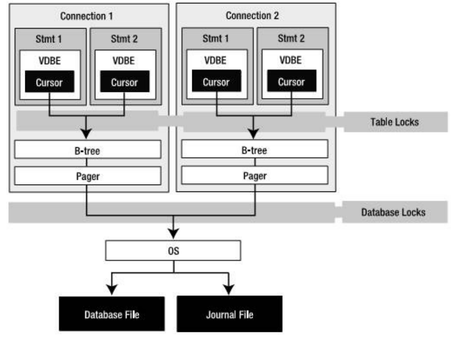

## SQLite 体系结构
sqlite 可以划分为3个子系统的8个独立模块组成。这些模块将查询过程划分为几个独立的任务，流水线工作pipline。在体系结构栈的顶部编译查询语句，在中部执行，在底部处理存储并于操作系统交互。
### 接口
接口位于栈的顶端，由SQLite C API 组成。
### 编译器
编译过程从词法分析器(Tokenizer)和语法分析器(Parser)开始。
SQLite语法分析器时手动编码实现的，由SQLite特定的语法分析生成器Lemon产生的。
### 虚拟机
架构栈的中心部分是虚拟机，即虚拟数据库引擎(Virtual DataBase Engine, VDBE)。VDBE是基于寄存器的VM，在字节码上工作，独立于顶层操作系统、CPU和系统体系结构。
### 后端
后端由B-tree、页缓存(page cache)以及操作系统接口组成。B-tree和pager一起作为信息代理。
B-tree的职责就是排序。它维护多个页之间的复杂关系，用来保证快速定位并找到一切有联系的数据。B-tree将页面组织成树状结构，页面就是树的叶子。pager(SQLite的一种数据结构)帮助B-tree管理页面。
OS接口会根据系统指定如何调用底层系统实现。所有的必须解决的OS问题在OS接口API中以文档的形式记录了。
### 工具和测试代码
工具中包含如内存分配、字符串比较、Unicode转换之类的公共服务。
测试模块中包含了回归测试用例，用来检查数据库代码的每个细节。

### 查询数据
``` sql
sqlite> select * from foods where name='Cinnamon Bobka';
sqlite> select last_insert_rowid();
``` 
### 修改数据
#### 插入记录
``` sql
sqlite> insert into foods (name, type_id) values('Cinnaomon Bobka', 1);
sqlite> insert into foods (NULL, 1, 'Blueberry Bobka');

sqlite> insert into foods
        values(null,
              (select id from food_types where name='Bakery'),
              'Blackberry Bobka');

sqlite> insert into foods
        select last_insert_rowid()+1, type_id, name 
        from foods
        where name='Chocolate Bobka';
```
#### 插入多行数据
``` sql
sqlite> create table foods2(id int, type_id int, name text);
sqlite> insert into foods2 select * from foods;
sqlite> select count(*) from foods2;
``` 
直接指定从select语句中创建表。
``` sql
sqlite> create table foods2 as select * from foods;
``` 
create table 与从foods表选择数据插入表两步并未一步，对于创建临时表特别有用。
``` sql
sqlite> create temp table list as
        select f.name food, t.name name,
               (select count(episode_id)
                from foods_episodes where food_id=f.id) episodes
        from foods f, food_types t
        where f.type_id=t.id;
``` 


#### 更新记录
``` sql
sqlite> update table set update_list where predicate;
``` 
#### 
``` sql
sqlite> delete from table where predicate;
``` 


### 数据完整性
数据完整性用于定义和保护表内部或表之间的数据关系。
一般有四种完整性：
**域完整性、实体完整性、引用完整性和用户自定义完整性。**
1. 域完整性设计控制字段内的值。
2. 实体完整性设计表中的行。
3. 引用完整性设计表之间的行，即外键关系。
4. 用户自定义完整新可以包罗万象。

数据完整性是通过约束实现的。约束就是对字段存储值的一种限制措施。数据库会对字段中的存储值进行完整性约束强制实施。
SQLite中，约束还包括对冲突解决的支持。

``` sql
sqlite> create table contacts (
        id integer primary key,
        name text not null collate nacase,
        phone text not null default 'UNKNOWN',
        unique (name,phone));
```
字段级的约束包括not null, unique, primary key, foreign key, check和collate。
表一级约束包括primary key, unique以及check。

#### 主键约束
在SQLite中,不管有没有定义主键,都会有一个字段,rowid,64-bit整性字段,还有两个别名_rowid_和oid, 默认取值按照增序自动生成。

像唯一性约束一样，主键约束也可以定义在多个字段中。
```sql
sqlite> create table pkey(x text, y text, primary key(x,y));
sqlite> insert into pkey values('x', 'y');
sqlite> insert into pkey values('x', 'x');
sqlite> select rowid, x, y from pkey;
```
|rowid|x|y|
|-|-|-|
|1|x|y|
|2|x|x|

#### 域完整性
定义：字段的值必须是字段定义范围内的。
域处理两个事情：**类型和范围**。
##### 默认值
default只是一个约束，它确保该字段有值，并在需要时出现。
default还可以接受3种预定格式的ANSI/ISO保留字，用于生成日期和时间值。
current_time生成格式(HH:MM:SS)的当前时间。
current_data生成格式(YYYY-MM-DD)的当前日期。
current_timestamp生成格式(YYYY-MM-DD HH:MM:SS)的事件戳。
```sql
sqlite> create table times
        (id integer, data not null default current_date,
        time not null default current_time,
        timestamp not null default current_timestamp);
```

##### NOT NULL
NOT NULL约束可以确保该字段不为NULL。处理未知数据和NOT NULL约束的实用方法时给该字段设定默认值。
##### check约束
check约束允许定义表达式来测试要插入或更新的字段值。
```sql
sqlite> create table contacts
        (id integer primary key, 
        name text not null collate nocase,
        phone text not null default 'UNKNOWN',
        unique (name, phone),
        check (length(phone)>=7));
```
所有字段的check约束都是在修改发生前评估的。
从功能上看，触发器可以与check约束一样有效地实现数据完整性。
##### 外键约束
SQLite支持关系理论中的关系完整性概念。关系完整性也叫外键。
```sql
sqlite> create table table_name
        (column_defination references foreign_table (column_name)
        on {delete|update} integrity_action
        [not] deferrable [initially{deferred|immediate},] _);
```


```sql
sqlite> create TABLE food_types
        (id integer primary key,
        name text);
sqlite> create TABLE foods
        (id integer primary key,
        type_id integer,
        name text);
```
为确保上面foods表中type_id之都存在与food_types的id字段，可如下方式定义表foods：

```sql
sqlite> create table foods
        (id integer primary key,
        type_id integer references food_types(id)
        on delete restrict
        deferrable initially deferred,
        name text);                  
```
完整的规定定义如下：
 * set null： 如果父值被删除获知不错在，剩余的子值将改为null；
 * set default: 如上，则子值改为默认值；
 * casecade: 更新父值时，更新所有预知匹配的子值。删除父值时，删除所有的子值。casecade的删除功能会出现意想不到的效果；
 * restrict： 更新或删除父值可能会出现孤立的子值，从而阻止事务；
 * no action: 使用一种松弛的方法，不干涉操作执行，只是观察变化。

##### 排序规则
SQLite有三种内置的排序规则，默认是二进制排序规则，该规则使用C函数memcpy()逐字节比较文本值。第二种是nocase，是拉丁字母中使用26个ASCII字符的非大小写敏感排序算法。第三种是reverse排序规则，它与二进制排序规则相反。

## 存储类
|名称|说明|
|-|-|
| integer|值是一个带符号的整数,根据值的大小存储在 1、2、3、4、6 或 8 字节中。|
|real|值是一个浮点值，存储为 8 字节的 IEEE 浮点数字。|
|text|值是一个文本字符串，使用数据库编码（UTF-8、UTF-16BE 或 UTF-16LE）存储。|
|blob|值是一个 blob 数据，完全根据它的输入存储。|
|NULL|值是一个 NULL 值。|

SQL函数typeof()根据值的表示法返回其存储类。
```sql
sqlite> select typeof(3.14), typeof('3.14'),
        typeof(314), typeof(x'3142), typeof(NULL);
```
|typeof(3.14)|typeof('3.14')| typeof(314)|typeof(x'3142)|typeof(NULL)|
|-|-|-|-|-|
|real|text|integer|blob|NULL|

**SQLite中单独的一个字段可能包含不同存储类的值。**

```sql
sqlite> drop table domain;
sqlite> create table domain(x);
sqlite> insert into domain values(3.142);
sqlite> insert into domain values('3.142');
sqlite> insert into domain values(3142);
sqlite> insert into domain values(x'3142');
sqlite> insert into domain values(null);
```
不同类型值的比较顺序
NULL<<integer=real<<text<<blob。

## 视图
视图即虚拟表，也称派生表，其内容都派生自其它表的查询结果。
```sql
sqlite> create view name as select-stmt;
```
```sql
sqlite> select f.name, ft.name, e.name 
        from foods f
        inner join food_types ft on f.type_id = ft.id
        inner join foods_episodes fe on f.id=fe.food_id
        inner join episodes e on fe.episode_id = e.id;
sqlite> create view details as
        select f.name as fd, tf.name as tp, e.name as ep, e.season as ssn
        from foods f
        inner join food_types ft on f.type_id=ft.id
        inner join foods_episodes fe on f.id= fe.food_id
        inner join episodes e on fe.episodes=e.id;
```
创建视图后，可以像查询表一样查询details
```sql
sqlite> select fd as Food, ep as Episode
        from details where ssn=7 and tp like 'Drinks';
```
视图的内容是动态生成的。因此，每次使用details时，基于数据库的当前数据执行相关的SQL语句，产生结果。
视图的删除
```sql
sqlite> drop view name;
```
## 索引

SQLite使用B-tree做索引。
索引可以加速查询，但可能降低insert、update和类似操作的速度。
```sql
sqlite> create index [unique] index_name on table_name (columns);
sqlite> drop index index_name;
```

### 使用索引
SQLite中有一些具体的条件来判断是否使用索引。
如果可以，对于下面会在WHERE子句中出现的表达式，SQLite将使用单个字段索引。
```sql
sqlite> column {=|>|>=|<|<=} expression
        expression {=|>|>=|<|<=} column
        column IN (expression-list)
        column IN (subquery)
```
最后，创建索引时，一定要有理由确保可以获得性能的改善。选择好的索引时非常重要的；分布凌乱的索引可能会导致希望获得良好的性能愿望落空。

## 触发器
```sql
sqlite> create [temp|temprary] trigger name
        [before|after] [insert|delete|update|update of columns] on table
        action
```
触发器时通过名称、行为和表定义的。行为(或者称为触发体)由一系列SQL命令组成，当某些事件发生时，触发器负责启动这些命令。
事件包括在具体的表中执行delete、insert和update命令。
触发器可以用来创建自定义完整性约束、日志变更、更新表和其它事情。
触发器的作用只限于所写的SQL命令。
### 更新触发器
与insert和delete触发器不同，update触发器可以在表的执行字段上定义。这种触发器的格式一般为：
```sql
sqlite> create trigger name
        [before|after] update of column on table
        action
```
下面时一个update触发器的SQL脚本
```sql
sqlite> create temp table log(x);
sqlite> create temp trigger foods_update_log update of name on foods
        begin
          insert into log values('updated foods: new name=' ||new.name);
        end;
```

### 错误处理
定义为事件发生前执行的触发器有机会阻止事件的发生，同样，定义为事件发生后执行的触发器可以检查事件，具备重新思考的机会。
before和after触发器可以具备实施新的完整性约束。
SQLite提供一个特殊的SQL函数raise()供触发器调用，该函数允许在触发器内产生错误。
```sql
sqlite> raise(resolution, error_message);
```
第一个参数时冲突解决策略(abort, fail, ignore, rollback等)。第二个参数时错误消息。

### 可更新的视图


## 事务
事务定义了一组SQL命令的边界。
### 事务的范围
事务由3个命令控制：begin、commit和rollback。
begin开始一个事务，如果没有commit，begin之后所有的操作会被取消，rollback类似。
commit提交事务开始后执行的所有操作。
SQLite也支持savepoint和release命令。包含多个语句的工作体可以设置savepoint，回滚可以返回到某个savepoint。
```sql
sqlite> savepoint justincase;
sqlite> rollback [transcation] to justincace;
```
### 冲突解决
SQLite有特殊的方法允许指定不同的方式来处理约束违反。
默认行为时终止命令并回滚所有修改，保证事务的完整性。
SQLite提供5种可能的冲突解决方案或策略：replace、ignore、fail、abort和rollback。
```sql
sqlite> insert or resolution into table (column_list) values(value_list);
sqlite> update or resolution table set (value_list) where predicate;
```
### 数据库锁
在SQLite中，锁和事务时紧密相连的。SQLite使用锁逐步提升机制，有5中不同的锁状态：未加锁(unlocked)、共享(shared)、预留(reserved)、未决(pending)、排它(exclusive)。

### 事务的类型
在SQLite有三种不同的事务类型，[deferred|immediate|exclusive].
```sql
sqlite> begin [deferred|immediate|exclusive] transaction;
```

# 总体设计和概念
对象模型

### 执行预查询
VDBE：虚拟数据库引擎(Virtual DataBase Engine,VDBE)；

执行一条SQL命令的处理分为以下三个步骤：
 * 准备：语法分析器、词法分析器以及代码生成器将命令编译成VDBE字节码，以准备SQL语句。编译器创建sqlite3_stmt句柄，包括字节码、执行命令和迭代结果集所需的所有其它资源。
 * 执行：VDBE执行字节码。执行时意个逐步的过程。C API中，每一步都由sqlite3_step()发起，并使VDBE逐步执行字节码。第一次调用slqite3_step()通常需要某种类型的锁，锁的类型根据执行什么样的命令(读或写)而变化。对于SELECT语句，sqlite3_step()的每次调用将使语句句柄的游标位置移动到结果集的下一行。对于结果集中的每一行，游标未到达结果集的末尾时，将返回SQLITE_ROW；反之，将返回SQLITE_DONE。对于其它SQL语句(insert, update, delete)，第一次调用sqlite3_step()将促使VDBE执行整个命令。
 * 完成：VDBE关闭语句并释放资源。C API中，由sqlite3_finalize()来执行，该函数使得VDBE终止程序、释放资源并关闭statement句柄。

以下伪代码说明SQLite中执行一个查询的通用处理
```sql
# 1. 打开数据库，创建一个连接对象db
db = open('foods.db')

# 2.A. 准备一个statement（stmt）
stmt = db.prepare('SELECT * FROM episodes')

# 2.b. 执行，调用step(), 直到游标到达结果集末尾。
while stmt.step() == SQLITE_ROW
    print stmt.colum('name');
end

# 2.c. 完成后释放读锁。
stmt.finalize()

# 3. 插入一条记录
stmt = db.prepare('INSERT INTO foods VALUES(...)')
stmt.step()
stmt.finalize()

# 4. 关闭数据库连接。
db.close()
```

#### 临时存储器
临时存储器可以是RAM或文件，并通过编译指示**temp_store**明确指定。采用基于文件的存储，可以使用编译指示**temp_store_directory**来明确存储文件的路径。

### 使用参数化SQL

SQL语句可以包含参数，参数就是占位符，可能会在编译后为其提供值。
```sql
sqlite> insert into foods (id,name) values(?,?);
sqlite> insert into episodes (id,name) (:id, :name);
```
参数绑定的优点是无需重新编译，就可以多次执行相同语句。可以避免SQL编译开销。
参数绑定的另一个优点时SQLite会处理绑定到参数的转义字符。避免了语法错误和可能的SQL注入式攻击。

```sql
db = open('foods.db')
stmt = db.prepare('insert into episodes (id, name) values (:id, :name)')

stmt.bind('id', '1')
stmt.bind('name', 'Soup Nazi')
stmt.step()

stmt.reset()
stmt.bind('id', '2')
stmt.bind('name', 'The Junior Mint')

stmt.finalize()
db.close()
```

### 错误处理
```
if db.errcode() != SQLITE_OK
        print db.errmg(stmt)
```
### SQL语句格式化
```c
char * before = "Hey, at least %q no pig-man.";
char * after = sqlite3_mprintf(before, "he's");
```

### 可操作的控制
API中包含很多监视、控制或限制数据库中发生什么的命令。
SQLite以过滤或者回调函数方式实现该功能，可以为指定事件注册要调用的函数。
由三种钩子函数：
 * sqlite3_commit_hook(),用于监视连接上的事务提交；
 * sqlite3_rollback_hook(),用于监视回滚；
 * sqlite3_update_hook(),用于监视insert、update和delete命令更改操作。

此外，API提供名为sqlite3_set_authorizer()的功能非常强大的编译时钩子。该函数几乎提供对数据库中发生的一切事件的细粒度控制，并能够限制对数据库、表和列的访问和修改。

### 使用线程
SQLite拥有一批在多线程环境中使用的函数。
在3.3.1版本中，SQLite引入了独特的运行模式：共享缓存模式。该模式时为多线程的嵌入式服务器设计的，它可以让单个线程拥有共享页面缓存的多个连接，从而减低服务器的总内存。


## 准备查询

### 编译
编译或准备接受SQL语句，并将其编译为虚拟数据库引擎VDBE刻度的字节码。
函数声明：
```c
int sqlite3_parepare_v2(
        sqlite3 *db, /* Database handle */
        const char *zSql, /* SQL text, UTF-8 encoded */
        int nBytes, /* Length of zSql in bytes. */
        sqlite3_stmt **ppStmt, /* OUT: Statement handle */
        const char **pzTail /* OUT: Pointer to unused portion of zSql */
);
```
函数sqlite3_prepare_v2()不会对连接或数据库有任何影响，也不会启动事务或获取锁。语句句柄高度依赖它们所被编译的数据库模式。如果另一个连接在您准备语句和实际执行语句期间更改了数据库模式，那准备语句就会失效。失效后会尝试重新编译，如果不能成功将会导致SQLITE_SCHEMA相关错误。

### 执行
查询语句就绪后，由sqlite3_step()执行。
```c
int sqlite3_step(sqlite3_stmt *pStmt);
```