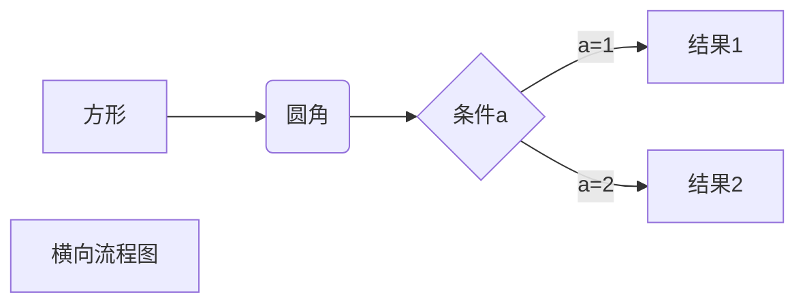

## SQLite 体系结构
sqlite 可以划分为3个子系统的8个独立模块组成。这些模块将查询过程划分为几个独立的任务，流水线工作pipline。在体系结构栈的顶部编译查询语句，在中部执行，在底部处理存储并于操作系统交互。
### 接口
接口位于栈的顶端，由SQLite C API 组成。
### 编译器
编译过程从词法分析器(Tokenizer)和语法分析器(Parser)开始。
SQLite语法分析器时手动编码实现的，由SQLite特定的语法分析生成器Lemon产生的。
### 虚拟机
架构栈的中心部分是虚拟机，即虚拟数据库引擎(Virtual DataBase Engine, VDBE)。VDBE是基于寄存器的VM，在字节码上工作，独立于顶层操作系统、CPU和系统体系结构。
### 后端
后端由B-tree、页缓存(page cache)以及操作系统接口组成。B-tree和pager一起作为信息代理。
B-tree的职责就是排序。它维护多个页之间的复杂关系，用来保证快速定位并找到一切有联系的数据。B-tree将页面组织成树状结构，页面就是树的叶子。pager(SQLite的一种数据结构)帮助B-tree管理页面。


```sequence
对象A->对象B: 对象B你好吗?（请求）
Note right of 对象B: 对象B的描述
Note left of 对象A: 对象A的描述(提示)
对象B-->对象A: 我很好(响应)
对象A->对象B: 你真的好吗？
```




```flow

//定义类型和描述

st=>start: 开始

e=>end: 结束

op=>operation: 我的操作

cond=>condition: 判断确认？

st->op->cond

cond(yes)->e

cond(no)->op

```

note:
使用 <kbd>Ctrl</kbd>+<kbd>Alt</kbd>+<kbd>Del</kbd> 重启电脑