# 1. Creational Patterns
##   1.1 Factory Method 
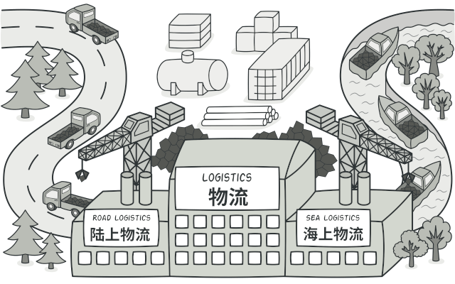
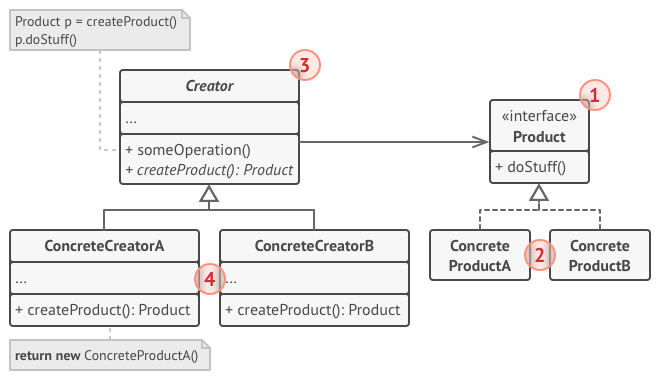

##   1.2 Abstract Factory 

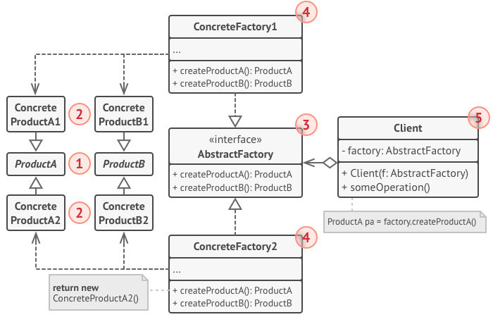

##   1.3 Builder
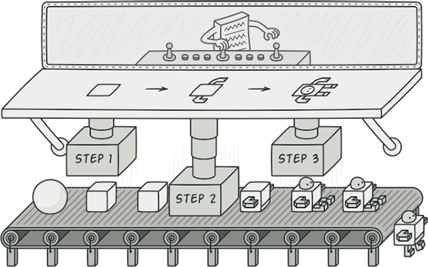
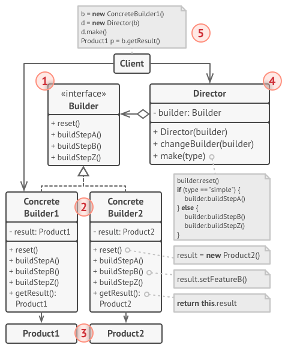

## 1.4 Prototype

## 1.5 Singleton
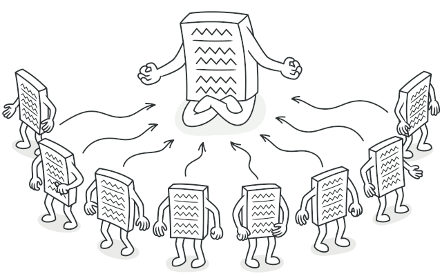
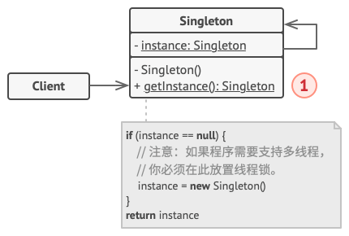

# 2. Structural Patterns
## 2.1 Adapter
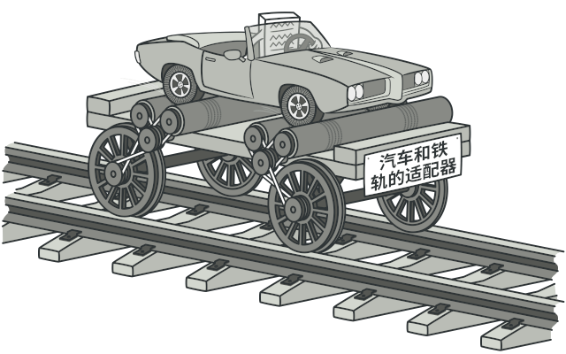
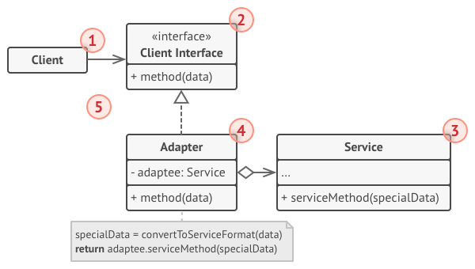

## 2.2 Bridge
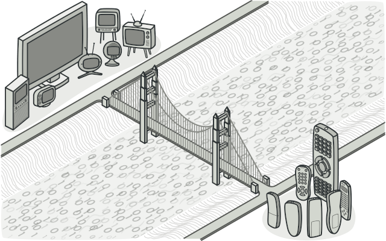
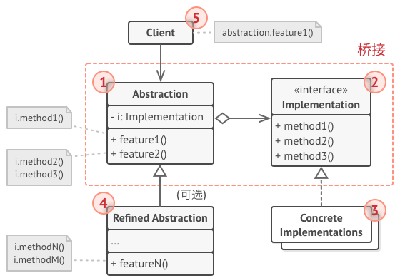

## 2.3 Composite
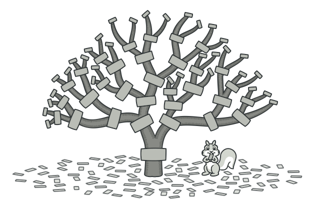
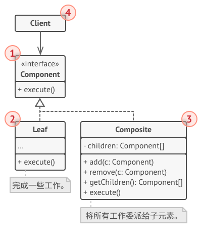

## 2.4 Decorator
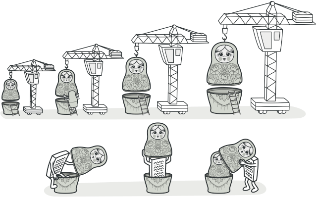
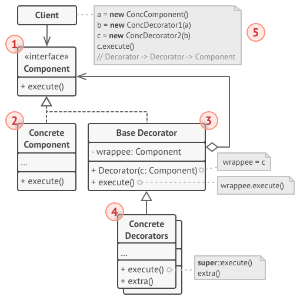

## 2.5 Facade
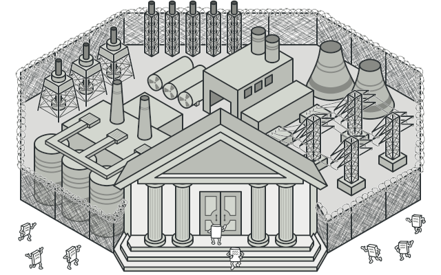

## 2.6 Flyweight
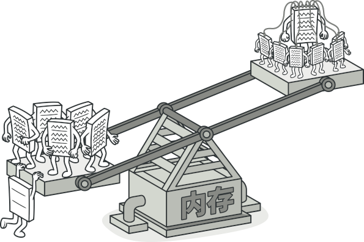
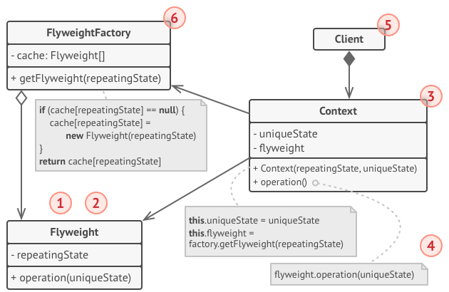

## 2.7 Proxy
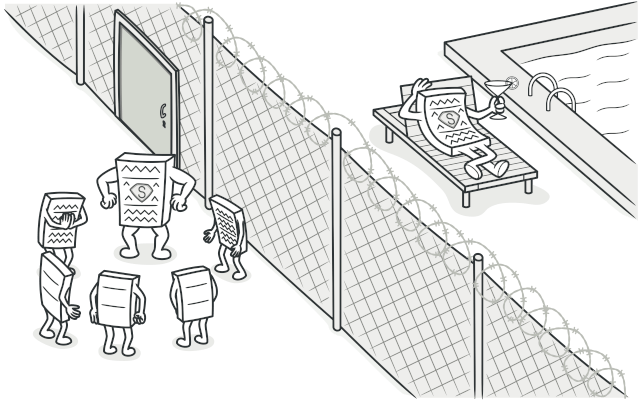
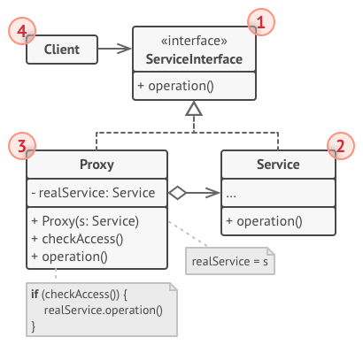

# 3. Behavioral Patterns
## 3.1 Chain of Responsibility

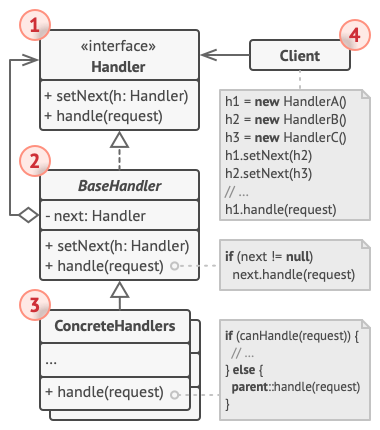

## 3.2 Command
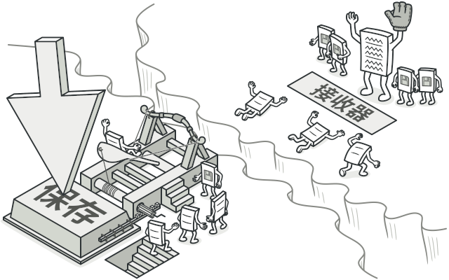
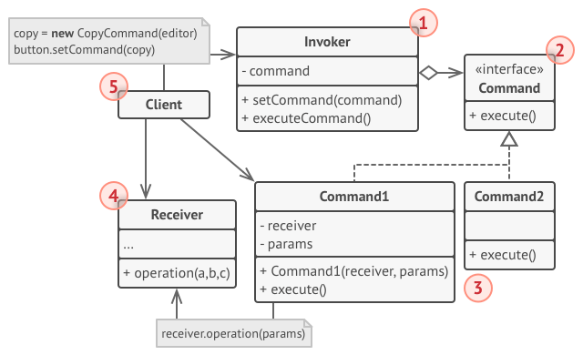

## 3.3 Iterator

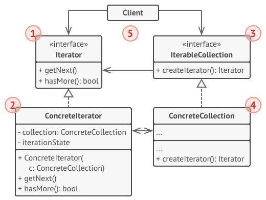

## 3.4 Mediator
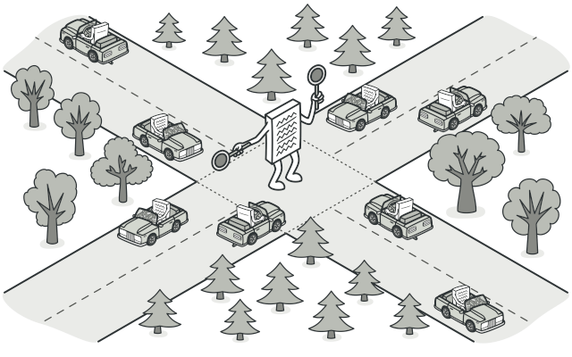
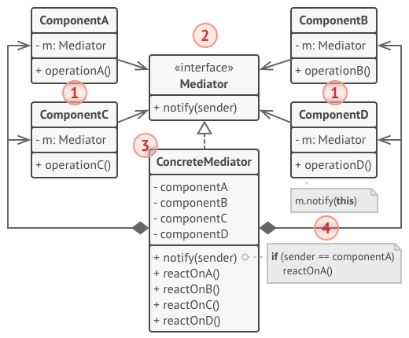

## 3.5 Memento

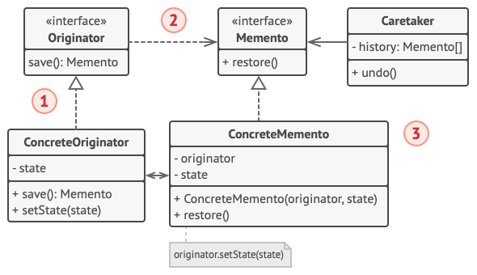

## 3.6 Observer
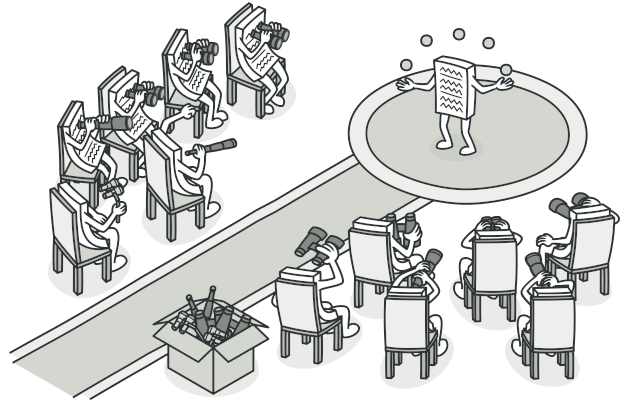

## 3.7 State
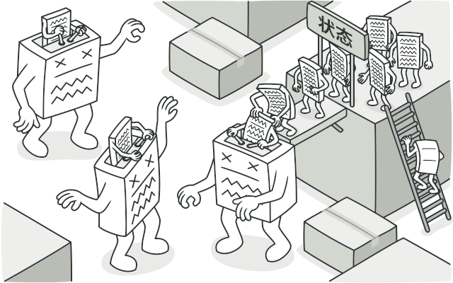
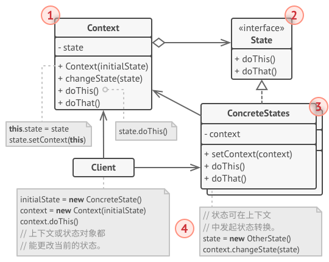

## 3.8 Strategy
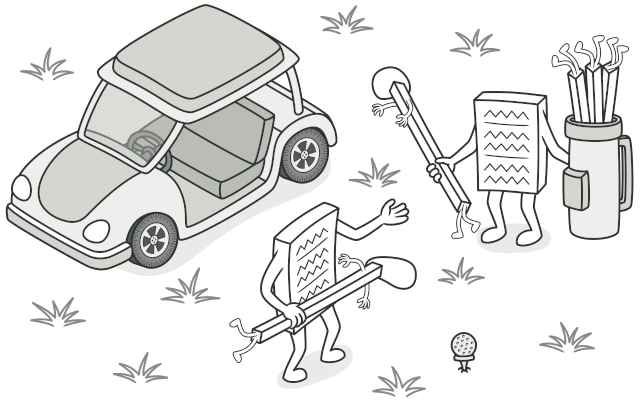
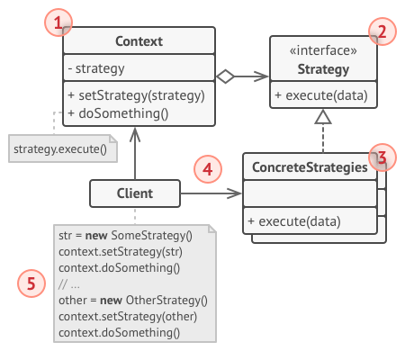

## 3.9 Template Method
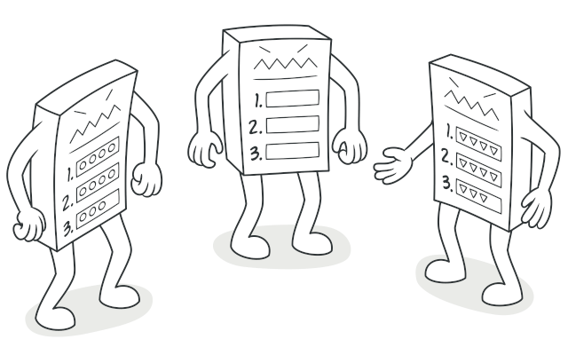
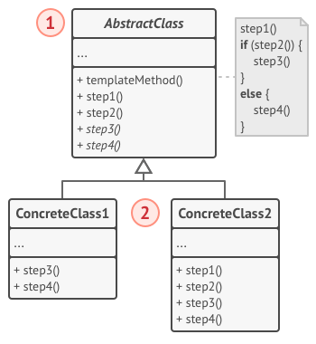

## 3.10 Vistor
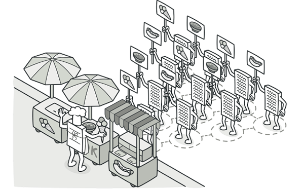
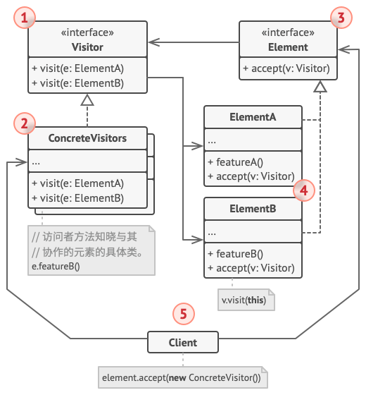

# 4 UML 
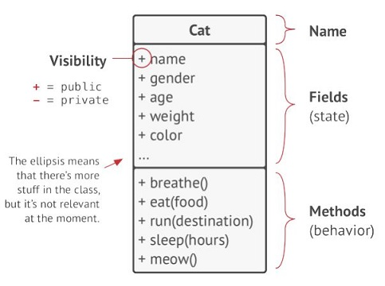
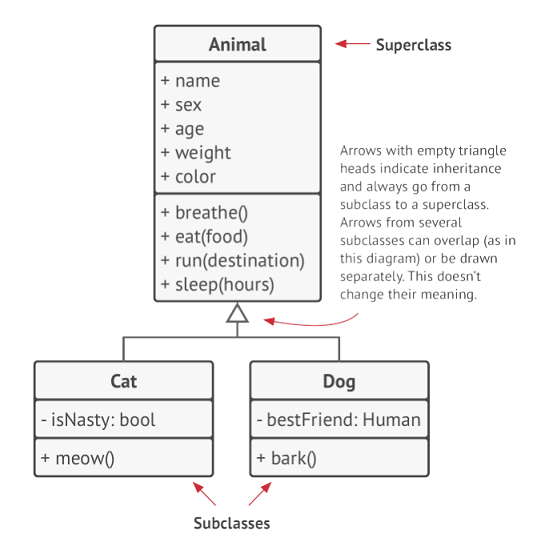

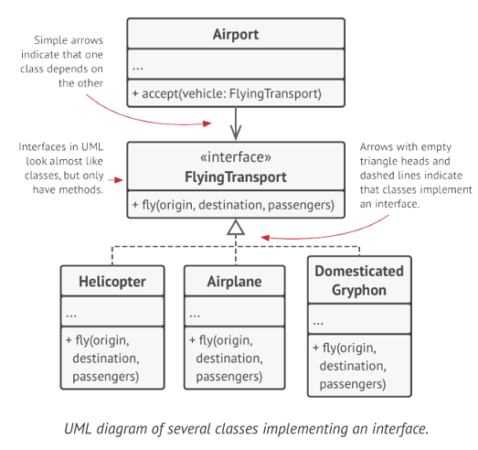

