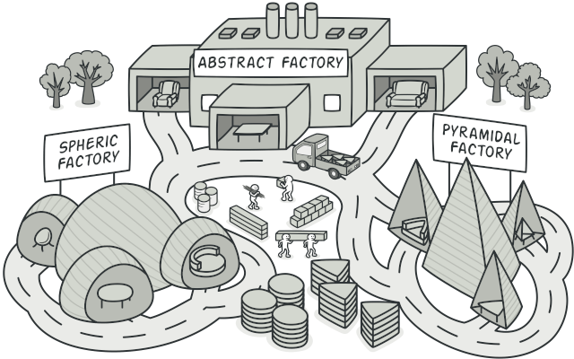
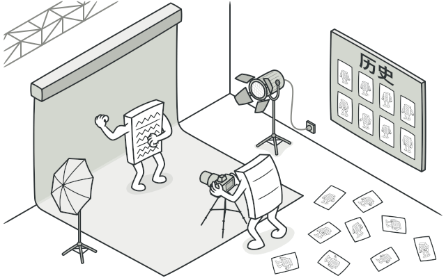
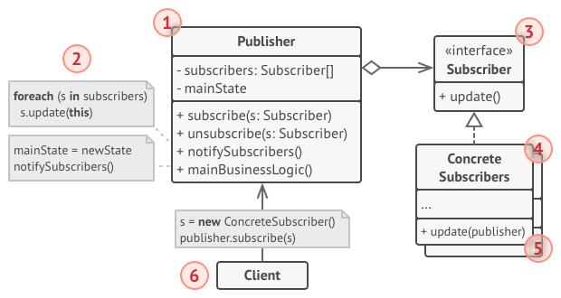

# 1. Creational Patterns
##   1.1 Factory Method 

##   1.2 Abstract Factory 

##   1.3 Builder

## 1.4 Prototype

## 1.5 Singleton

# 2. Structural Patterns
## 2.1 Adapter

## 2.2 Bridge

## 2.3 Composite

## 2.4 Decorator

## 2.5 Facade

## 2.6 Flyweight

## 2.7 Proxy

# 3. Behavioral Patterns
## 3.1 Chain of Responsibility

## 3.2 Command

## 3.3 Iterator

## 3.4 Mediator

## 3.5 Memento

## 3.6 Observer

## 3.7 State

## 3.8 Strategy

## 3.9 Template Method

## 3.10 Vistor

# 4 UML 

